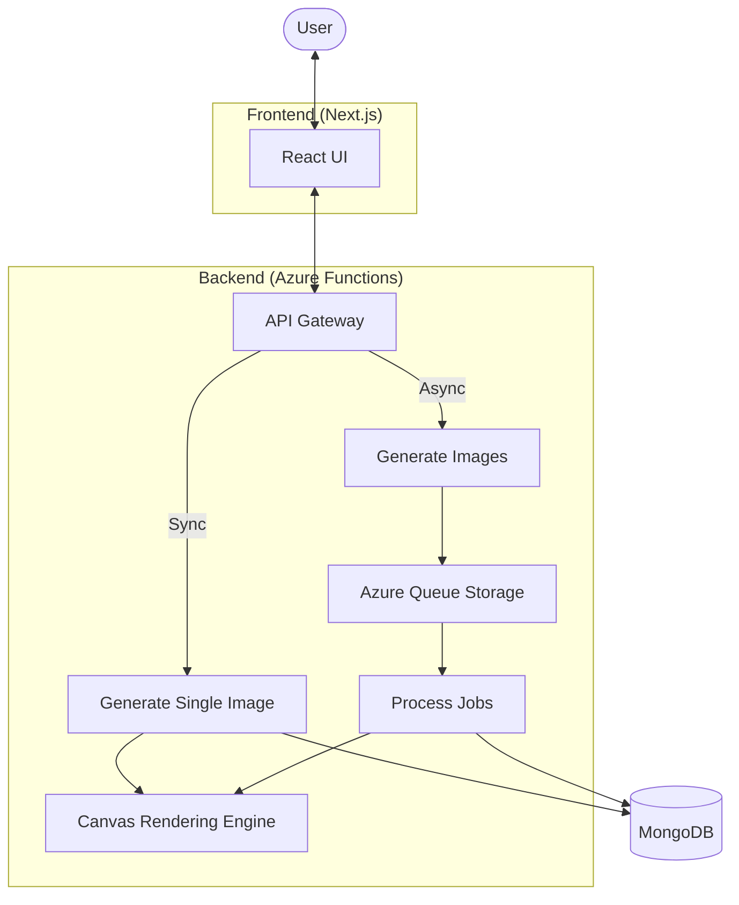

# Cover Craft

## What is this?

This is a serverless image generation platform built on Azure.

It demonstrates how a real full-stack / cloud system would:
- generate images synchronously and asynchronously
- scale automatically using serverless architecture
- enforce accessibility (WCAG) at the system level
- process batch workloads using event-driven pipelines
- deploy infrastructure using Infrastructure as Code

The goal is to show how to build a scalable, accessible, and production-ready application using modern cloud architecture.

🌐 [Project Portal](https://cover-craft-ui.azurewebsites.net/)  
📚 [Full Documentation](./docs/README.md)

---

## 🔍 What I Built (Quick Proof)

- Serverless backend using Azure Functions (auto-scaling)
- Dual execution model: synchronous + asynchronous processing
- Event-driven batch processing using Azure Queue Storage
- Canvas-based image rendering engine
- WCAG AA accessibility validation built into generation logic
- Full-stack TypeScript monorepo (frontend + backend)
- CI/CD pipelines using GitHub Actions
- Infrastructure as Code using Terraform (OpenTofu)
- Real-time analytics and performance tracking
- Stateless, privacy-first architecture (no user data stored)

---

## 📦 Platform Projects

This system is built as a collection of smaller full-stack and cloud projects:

1. **Serverless API Platform**
   - Azure Functions handling scalable backend workloads

2. **Image Rendering Engine**
   - Canvas-based dynamic image generation system

3. **Async Batch Processing System**
   - Queue-based architecture for high-concurrency workloads

4. **Accessibility Engine**
   - WCAG AA validation integrated into rendering pipeline

5. **Frontend Application**
   - Next.js UI with real-time feedback and UX optimization

6. **CI/CD Pipeline**
   - Automated build, test, and deployment using GitHub Actions

7. **Infrastructure as Code**
   - Terraform (OpenTofu) managing Azure resources

8. **Analytics & Telemetry**
   - Performance tracking (P95/P99) and usage insights

9. **Validation Layer**
   - Zod schema validation across frontend and backend

10. **Monorepo Architecture**
   - Shared types and logic across full-stack system

---

## 🧠 Problems I Solved

- Slow image generation → added async queue-based processing
- Poor scalability → used serverless functions for auto-scaling
- Accessibility issues → enforced WCAG rules at generation time
- Inconsistent validation → unified schemas across frontend/backend
- Complex deployments → automated with CI/CD + IaC
- Data privacy concerns → designed stateless, zero-persistence system

---

## 🛠️ Tech Stack

**Frontend**
- Next.js, React, Tailwind CSS

**Backend**
- Azure Functions (Node.js / TypeScript)
- Canvas API for rendering

**Cloud & Infrastructure**
- Azure Queue Storage
- MongoDB
- Terraform (OpenTofu)

**DevOps**
- GitHub Actions (CI/CD)
- Monorepo architecture

**Testing**
- Vitest

---

## 🏗️ System Architecture

The platform supports two execution paths:
- synchronous (fast response)
- asynchronous (batch processing)



---

## 🔎 Example: Request Flow

### Single Image (Fast Path)
- User submits request
- API generates image immediately
- Response returned in real-time

### Bulk Image (Scalable Path)
- User submits batch request
- Jobs pushed to queue
- Worker processes images asynchronously

---

## ⚠️ Challenges

One challenge was handling large batch image generation efficiently.

- **Problem:** High load caused slow response times
- **Cause:** synchronous processing bottleneck
- **Fix:** moved bulk requests to queue-based async processing using Azure Queue Storage

---

## 🚀 Project Evolution

This platform evolved through several stages:

- **Architecture Setup:** Designed serverless-first system
- **Frontend + Backend:** Built full-stack Next.js + Functions
- **Accessibility Engine:** Added WCAG validation
- **Performance Optimization:** Improved UX with async processing
- **Scaling:** Introduced queue-based batch system
- **Infrastructure:** Automated deployment with Terraform

👉 [View Full Evolution](https://cover-craft-ui.azurewebsites.net/evolution)

---

## 🚀 Getting Started

<details>
<summary><b>Local Setup</b></summary>

### Install dependencies

```bash
npm install
```

### Run frontend

```bash
npm run dev
```

### Deploy infrastructure

```bash
cd infra
tofu init
tofu apply
```

</details>

---

## 📌 Summary

This project demonstrates how to build a scalable, production-ready application using:

- Serverless architecture (Azure Functions)
- Event-driven processing (queues)
- Accessibility-first design (WCAG)
- Infrastructure as Code
- Full-stack TypeScript system

It reflects how modern cloud applications are built and scaled in real environments.
