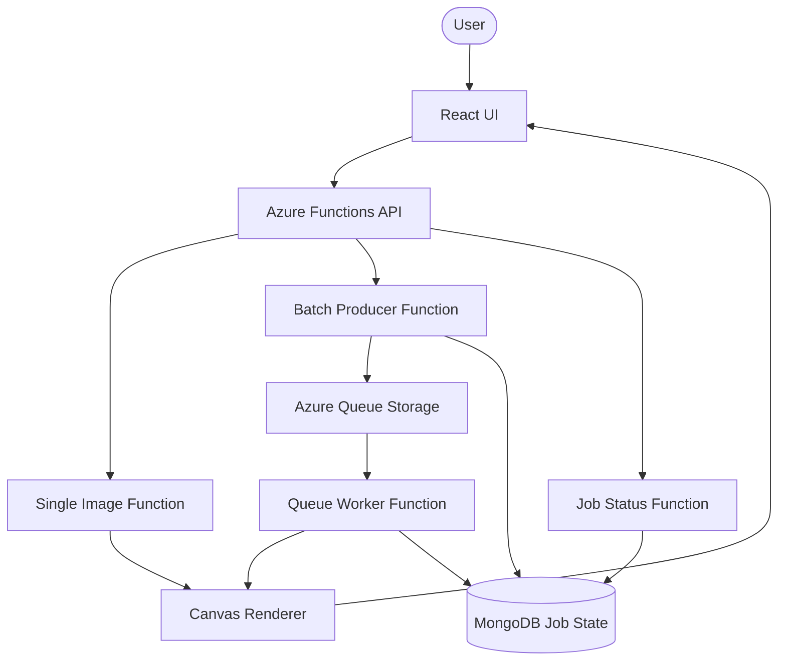

# Cover Craft

Cover Craft is a serverless cover image generator built with React, Azure Functions, Azure Queue Storage, and MongoDB.

It supports fast single-image generation and queued batch processing, with shared validation and accessibility checks built into the generation flow.

[Live Project](https://cover-craft-ui.azurewebsites.net/) | [Full Documentation](./docs/README.md)

---

## Highlights

| Area | What it demonstrates |
| :--- | :--- |
| Background processing | Batch requests return HTTP 202, then move through Azure Queue Storage to a queue-triggered worker |
| State flow | MongoDB tracks job status from `pending` to `processing`, `completed`, or `failed` |
| Failure handling | Atomic worker claiming prevents duplicate rendering when queue messages are redelivered |
| Progress tracking | The UI polls job status so users can follow batch progress after submission |
| Accessibility | WCAG contrast validation is part of the image generation workflow |
| Shared validation | Frontend and backend use shared validators for image parameters and batch requests |
| Deployment | GitHub Actions and OpenTofu support repeatable Azure deployment |

---

## Architecture

The platform has two generation paths:

| Path | Use case | Flow |
| :--- | :--- | :--- |
| Single image | Fast interactive generation | User request -> Azure Function -> Canvas renderer -> image response |
| Batch images | Larger workloads | User request -> HTTP 202 -> Azure Queue Storage -> worker -> MongoDB job status |



---

## Tech Stack

| Layer | Tools |
| :--- | :--- |
| Language | TypeScript, Node.js, React, Tailwind CSS |
| Infrastructure | Azure Functions, Azure Queue Storage, Azure hosting, OpenTofu |
| Data stores | MongoDB for job state and logs |
| Testing | Vitest |
| CI/CD | GitHub Actions |

---

## Documentation

- [Architecture](./docs/architecture/README.md)
- [Operations and CI/CD](./docs/operations.md)
- [Decisions](./docs/decisions/README.md)
- [Incidents](./docs/incidents/README.md)

---

## Local Setup

```bash
npm install
npm run build:shared
npm run dev:frontend
```

Run the API locally:

```bash
npm run start:api
```

Run checks:

```bash
npm run lint
npm run test
```
