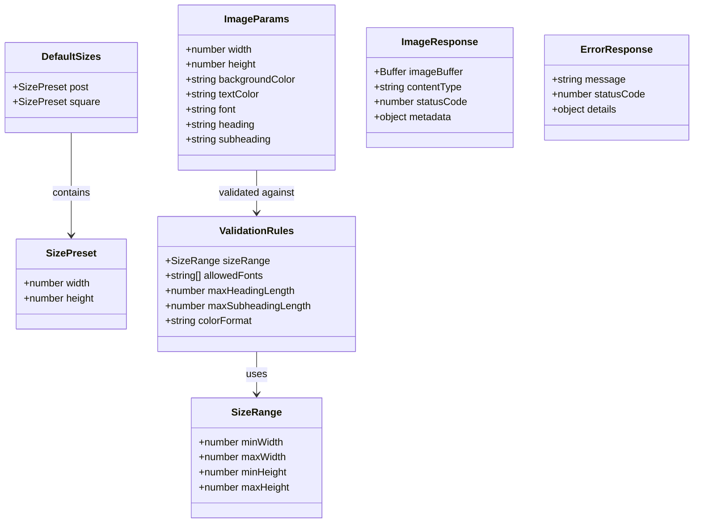
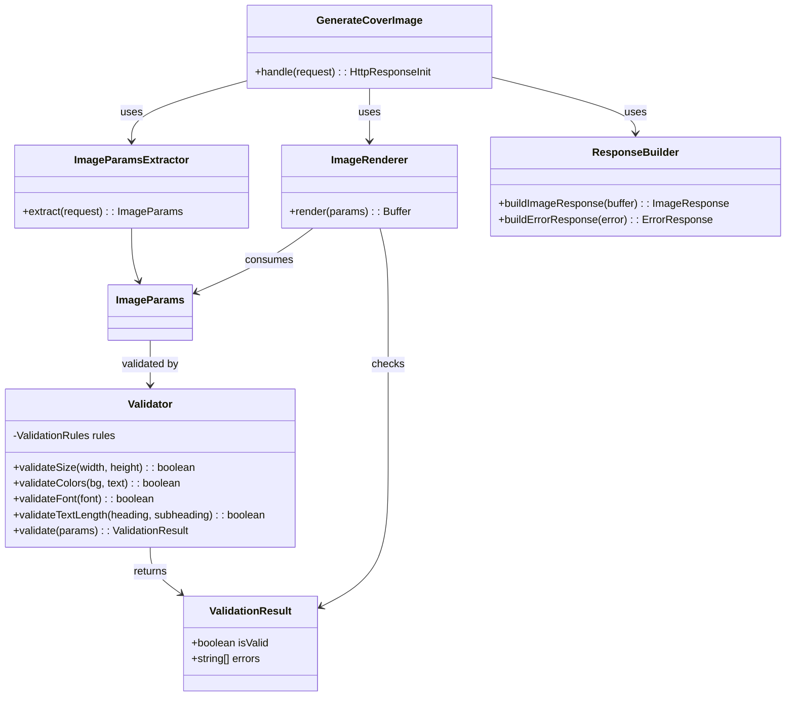
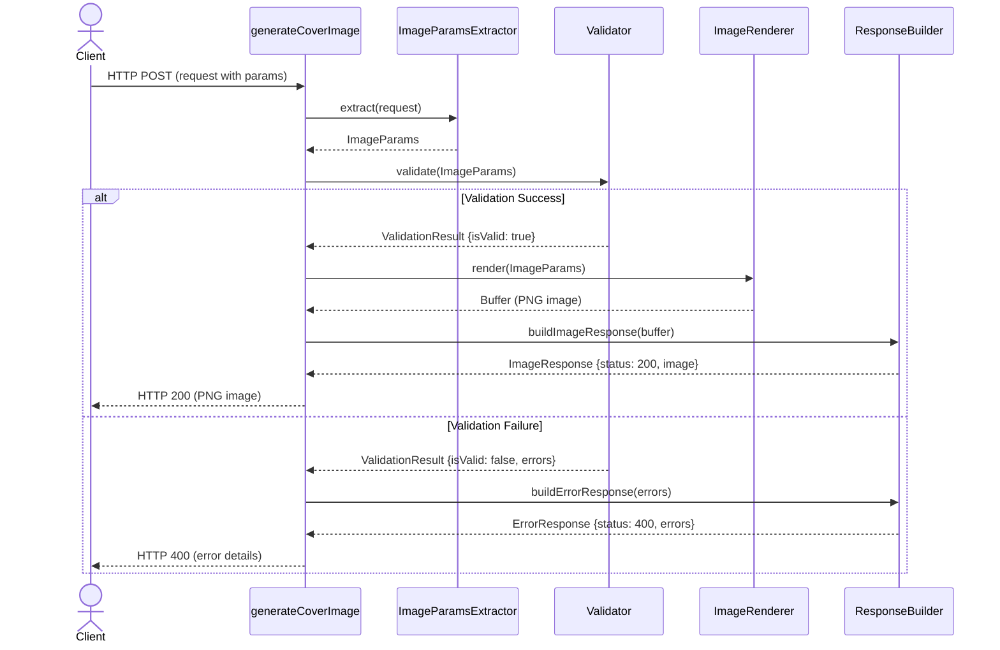

# Architecture

> **Draft Version**: This architecture document is in draft state and subject to revision as the project evolves.

## Highlights

- **Modular Design**: The system is divided into clear, single-responsibility components (extraction, validation, rendering, response building)
- **Server-side Validation First**: All inputs are validated on the backend to ensure system safety, regardless of frontend validation
- **Flexible Sizing**: Supports both predefined size presets (e.g., `post: 1200x627`, `square: 1080x1080`) and custom dimensions within acceptable ranges
- **Clean Data Flow**: Request parameters flow through extraction → validation → rendering → response, with error handling at each stage
- **Extensible Architecture**: Easy to add new sizes, fonts, or validation rules without modifying core logic
- **PNG Image Output**: Direct binary PNG response allows clients to download or display images without additional processing

## Default Sizes

The system supports predefined size presets to ensure consistency and easy expansion:

```ts
const defaultSizes = {
    post: { width: 1200, height: 627 },
    square: { width: 1080, height: 1080 }
    // Future sizes can be added here:
    // banner: { width: 1600, height: 400 }
};
```

- **post**: Standard social media post size (1200x627)
- **square**: Square format commonly used for profile pictures and social media tiles (1080x1080)
- Easily extensible for future formats (e.g., banner, story, thumbnail)

## Data Model



## Functional Flow



## generateCoverImage Sequence Diagram


