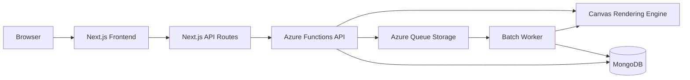

# Architecture

This directory documents the main system architecture for Cover Craft across the frontend and backend services.

| Area | Document | Scope |
| :--- | :--- | :--- |
| Frontend | [Frontend Architecture](./frontend.md) | Next.js App Router, BFF proxy layer, hooks, UI structure, and accessibility validation. |
| Backend | [Backend Architecture](./backend.md) | Azure Functions, image rendering, batch jobs, MongoDB persistence, and analytics APIs. |

## System View

Cover Craft is split into a Next.js frontend and an Azure Functions backend. Shared validation rules and types live in `@cover-craft/shared`, while Azure cloud resources are managed through OpenTofu.

