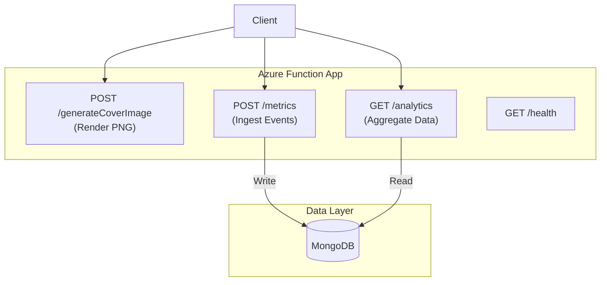

# Backend Architecture

The backend is a serverless API built on Azure Functions (v4, Node.js), responsible for image generation, metrics collection, and analytics aggregation. It interacts with MongoDB for persistence and uses `node-canvas` for server-side rendering.

## Core Tech Stack

- **Runtime:** Azure Functions (Node.js 20+)
- **Rendering:** `canvas` (Server-side implementation of HTML5 Canvas)
- **Database:** MongoDB (via `mongoose`)
- **Testing:** Vitest
- **Shared Logic:** `@cover-craft/shared` (Types & Validators)

## System Architecture



## Functions

### 1. Generate Cover Image

**Endpoint:** `POST /api/generateCoverImage`

Generates a PNG based on parameters. Uses `shared/validators.ts` to enforce constraints before rendering.

- **Input:** `ImageParams` (JSON or Query Params)
- **Output:** `image/png` Buffer
- **Key Logic:**
    1. **Validation:**
        - `width/height`: 1px - 1200px
        - `title`: Max 40 chars
        - `subtitle`: Max 70 chars
        - `colors`: Hex format only
        - **Contrast:** WCAG AA (ratio ≥ 4.5:1) checked via `getContrastRatio()`
    2. **Rendering:**
        - Uses `canvas` to draw background and text.
        - Dynamic font sizing: Title (9% of height), Subtitle (7% of height).
    3. **Telemetry:**
        - Records execution duration (`Server-Timing` header).
        - Async write to `metrics` collection on success/failure.

### 2. Metrics Ingestion

**Endpoint:** `POST /api/metrics`

Ingests client-side performance and usage data.

- **Schema:** `MetricPayload` (defined in `shared/metricPayload.ts`)
- **Persistence:** stored in `metrics` collection via Mongoose.

### 3. Analytics Aggregation

**Endpoint:** `GET /api/analytics`

Performs on-the-fly aggregation of the `metrics` collection.

- **Architecture:** Logic is decomposed into `api/src/lib/analyticsQueries.ts` (Repository Pattern) to separate data access from the HTTP handler.
- **Pipeline Stages:**
  - **User Engagement:** Counts `generate_click` vs `download_click`.
  - **Performance:** Calculates P50/P95/P99 latencies for backend vs client duration.
  - **Accessibility:** Aggregates WCAG compliance (AAA/AA/FAIL).
  - **Trends:** Hourly/Daily grouping of usage.

## Data Models

The backend relies on shared TypeScript definitions to ensure type safety across the API and Database interactions.

### Metric Payload (Ingress)

*Source: `shared/metricPayload.ts` (via `@cover-craft/shared`)*

```typescript
export interface MetricPayload {
    event: "generate_click" | "download_click" | "image_generated";
    timestamp: string;
    status: "success" | "error" | "validation_error";
    
    // Performance
    duration?: number;       // Backend execution time (ms)
    clientDuration?: number; // Total client-side wait time (ms)
    
    // Usage Context
    size?: { width: number; height: number };
    font?: string;
    wcagLevel?: "AAA" | "AA" | "FAIL";
    contrastRatio?: number;
    titleLength?: number;
    subtitleLength?: number;
}
```

### Analytics Result (Egress)

*Source: `shared/analytics.ts` (via `@cover-craft/shared`)*

```typescript
export type AnalyticsResult = {
    userEngagement: {
        uiGenerationAttempts: number;
        totalSuccessfulGenerations: number;
        uiUsagePercent: number;
        apiUsagePercent: number;
        totalDownloads: number;
        downloadRate: number;
        hourlyTrend: Array<{ hour: number; count: number }>;
    };
    featurePopularity: {
        topFonts: Array<{ font: string; count: number }>;
        topSizes: Array<{ size: string; count: number }>;
        subtitleUsagePercent: number;
    };
    accessibilityCompliance: {
        wcagDistribution: Array<{ level: string; count: number }>;
        contrastStats: { avgContrastRatio: number; minContrastRatio: number; maxContrastRatio: number };
    };
    performanceMetrics: {
        backendPerformance: { avgBackendDuration: number; p95BackendDuration: number };
        clientPerformance: { avgClientDuration: number; p95ClientDuration: number };
        networkLatency: { avgNetworkLatency: number };
    };
};
```

### Mongoose Schema (Persistence)

*Source: `api/src/lib/mongoose.ts`*

```typescript
const metricSchema = new mongoose.Schema({
    event: { type: String, required: true, index: true },
    timestamp: { type: Date, required: true, index: true },
    status: { type: String, enum: ["success", "error", "validation_error"] },
    
    // Metadata
    size: { width: Number, height: Number },
    font: String,
    titleLength: Number,
    subtitleLength: Number,
    
    // Accessibility & Performance
    contrastRatio: Number,
    wcagLevel: String,
    duration: Number,
    clientDuration: Number
});
```
