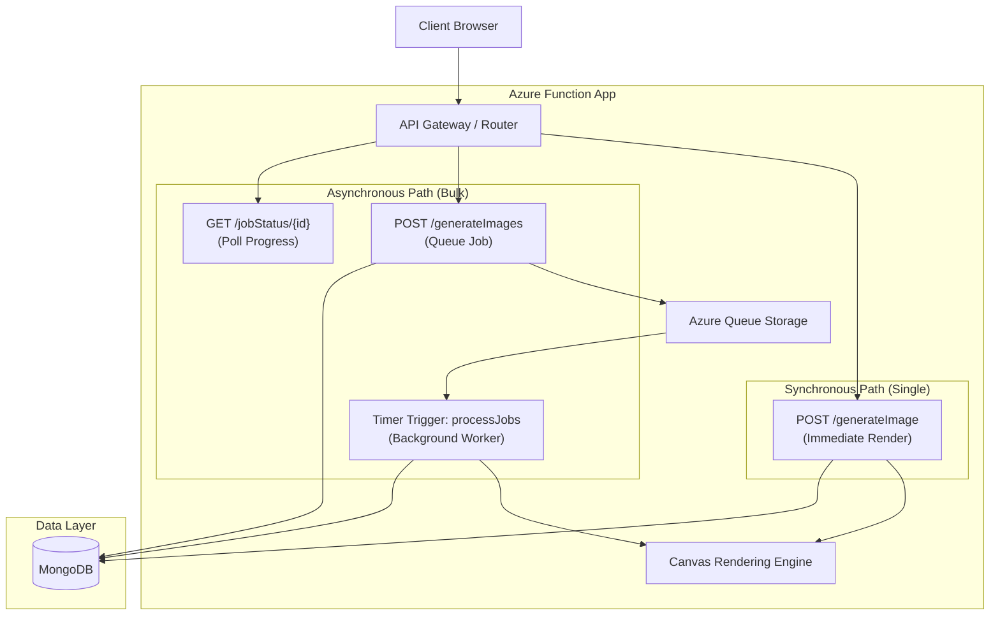

# Backend Architecture

The backend is a serverless API built on Azure Functions (v4, Node.js 22), responsible for high-fidelity image generation, metrics collection, and asynchronous batch processing. It leverages a dual-path execution model to balance immediate UI feedback with scalable bulk operations, hosted on the **Flex Consumption (`FC1`)** plan for optimal performance and regional stability.

## Core Tech Stack

- **Runtime:** Azure Functions (Node.js 22)
- **Hosting:** Azure Functions Flex Consumption (`FC1`)
- **Infrastructure:** OpenTofu / Terraform (IaC)
- **Rendering:** `canvas` (Server-side implementation of HTML5 Canvas)
- **Database:** MongoDB (via `mongoose`)
- **Messaging:** Azure Queue Storage (for asynchronous job orchestration)
- **Testing:** Vitest
- **Shared Logic:** `@cover-craft/shared` (Validators, Job Status Constants, and Types)

## System Architecture

The platform implements two distinct execution patterns optimized for different workloads:


```mermaid
graph TD
    Client[Client Browser]
    subgraph Azure["Azure Function App"]
        Gateway[API Gateway / Router]
        
        subgraph SyncPath["Synchronous Path (Single)"]
            Single["POST /generateImage<br/>(Immediate Render)"]
        end
        
        subgraph AsyncPath["Asynchronous Path (Bulk)"]
            Bulk["POST /generateImages<br/>(Queue Job)"]
            Status["GET /jobStatus/{id}<br/>(Poll Progress)"]
            Worker["Timer Trigger: processJobs<br/>(Background Worker)"]
        end
        
        Render[Canvas Rendering Engine]
        Queue[Azure Queue Storage]
    end

    subgraph Data["Data Layer"]
        Mongo[(MongoDB)]
    end

    Client --> Gateway
    Gateway --> Single
    Gateway --> Bulk
    Gateway --> Status
    
    Single --> Render
    Single --> Mongo
    
    Bulk --> Queue
    Bulk --> Mongo
    
    Queue --> Worker
    Worker --> Render
    Worker --> Mongo
```

## Functions

### 1. Generate Single Image (Synchronous)

**Endpoint:** `POST /api/generateImage`

Direct, low-latency rendering path for immediate UI preview and single-image downloads.

- **Validation:** Enforces WCAG AA contrast (ratio ≥ 4.5:1) and strict schema validation via `shared/validators.ts`.
- **Output:** Returns an `image/png` buffer directly to the requester.
- **Telemetry:** Records execution duration and accessibility metrics in MongoDB.

### 2. Bulk Image Generation (Asynchronous)

**Endpoint:** `POST /api/generateImages`

Decoupled entry point for batch processing. Validates the request and persists a "pending" job state before offloading to the queue.

- **Workflow:**
    1. Validates the batch request (array of image configurations).
    2. Creates a `Job` document in MongoDB with `status: 'pending'`.
    3. Pushes the `jobId` to Azure Queue Storage.
    4. Returns the `jobId` immediately to the client.

### 3. Job Status Tracking

**Endpoint:** `GET /api/jobStatus/{id}`

Allows the frontend to poll the current progress of a batch operation.

- **Status States:** `pending` -> `processing` -> `completed` | `failed`.
- **Response:** Includes the total count, processed count, and an array of generated image URLs (Base64 or Blob storage links).

### 4. Process Jobs (Background Worker)

**Trigger:** Timer Trigger (configurable interval) or Queue Trigger.

The core orchestration engine for batch workloads.

- **Logic:**
    1. Picks up `jobId` from the queue.
    2. Updates MongoDB status to `processing`.
    3. Iteratively calls the `Canvas Rendering Engine` for each item in the batch.
    4. Updates the job document with progress and generated assets.
    5. Marks the job as `completed` upon success.

### 5. Analytics & Metrics

**Endpoints:** `POST /api/metrics`, `GET /api/analytics`

- **Ingestion:** Captures P95/P99 latencies, WCAG compliance rates, and feature usage.
- **Aggregation:** Uses MongoDB aggregation pipelines (`api/src/lib/analyticsQueries.ts`) to provide on-the-fly system health insights.

## Data Models

The backend utilizes shared models from `@cover-craft/shared` to maintain strict contract integrity.

### Job Schema (Persistence)

```typescript
export interface IJob {
    jobId: string;
    status: "pending" | "processing" | "completed" | "failed";
    totalImages: number;
    processedImages: number;
    results: Array<{
        url: string; // Base64 or Storage Link
        fileName: string;
    }>;
    error?: string;
    createdAt: Date;
    updatedAt: Date;
}
```
