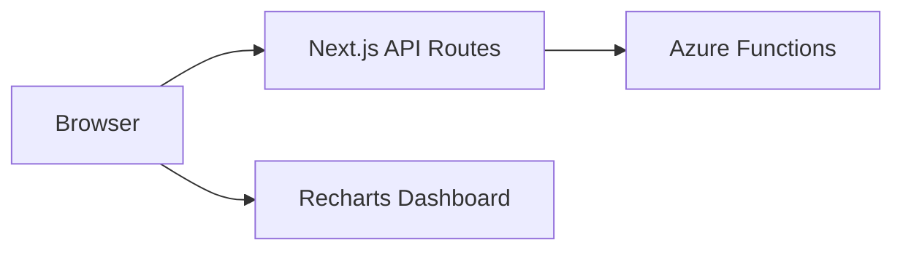

# Frontend Architecture

The frontend is a **Next.js (App Router)** application that provides a real-time editing experience. It uses a **Proxy Layer** to communicate with the Azure Functions backend, ensuring the client remains decoupled from the serverless infrastructure.

## Core Tech Stack

- **Framework:** Next.js 15+ (App Router)
- **Styling:** Tailwind CSS + CSS Variables (for dynamic font injection)
- **State:** React Hooks (`useState`, `useMemo`, `useCallback`)
- **Metrics:** Recharts (for analytics visualization)

## System Architecture



## Architectural Patterns

### 1. The Proxy Pattern

All client requests to `POST /api/generateCoverImage` or `GET /api/analytics` are handled by Next.js route handlers.

- **Benefit:** Hides the Azure Function endpoint, prevents CORS issues, and allows for request/response transformation before reaching the client.

### 2. Hybrid Rendering

- **Live Preview:** Uses standard React state and inline CSS (via `fontFamilyMap`) for instantaneous visual feedback while typing.
- **Final Render:** The "Generate" button triggers a server-side request to the Azure Function, which uses `node-canvas` to produce a high-fidelity PNG buffer.

### 3. Progressive Enhancement (Downloads)

The application attempts to use the **FileSystem API** for downloads to provide a better user experience (file picker), with a standard `<a>` tag fallback for legacy browsers.

## Component Structure

| Type | Examples | Responsibility |
| :--- | :--- | :--- |
| **Pages** | `page.tsx` (Landing), `generate/page.tsx`, `evolution/page.tsx`, `analytics/page.tsx` | Entry points for the application's distinct routes. |
| **Forms** | `CoverForm`, `FormField` | Encapsulates input logic, contrast validation, and error state. |
| **UI** | `Button`, `Input`, `Card`, `SectionTitle`, `ColorPicker` | Stateless, reusable atoms styled with Tailwind. |
| **Preview** | `CanvasPreview` | Logic to toggle between CSS-based preview and generated PNG `Blob`. |

## Custom Hooks (The Logic Layer)

| Hook | Source | Responsibility |
| :--- | :--- | :--- |
| `useForm` | `hooks/useForm.ts` | Orchestrates form state, validation, and the generate/download workflow. |
| `useContrastCheck` | `hooks/useContrastCheck.ts` | Performs debounced (300ms) WCAG AA compliance checks on color pairs. |
| `useAnalytics` | `hooks/useAnalytics.ts` | Manages the lifecycle of the analytics data fetch. |

## Data Models

### Form State

```typescript
interface FormData {
  size: string;             // Label e.g., "Post (1200 × 627)"
  title: string;            // Max 40 chars
  subtitle?: string;        // Max 70 chars
  backgroundColor: string;  // Hex
  textColor: string;        // Hex
  font: string;             // Valid FONT_OPTIONS entry
  filename: string;         // User-defined or default
}
```

### Analytics Result

```typescript
interface AnalyticsResult {
  userEngagement: { uiGenerationAttempts: number; totalSuccessfulGenerations: number; uiUsagePercent: number; apiUsagePercent: number; totalDownloads: number };
  featurePopularity: { topFonts: Array<{ font: string; count: number }> };
  accessibilityCompliance: { wcagDistribution: Array<{ level: string; count: number }> };
  performanceMetrics: { backendPerformance: { p95BackendDuration: number } };
}
```

## Accessibility & Validation

- **WCAG AA Enforced:** The "Generate" button is programmatically disabled unless the contrast ratio is ≥ 4.5:1.
- **Screen Reader Support:** Includes `aria-live="polite"` on preview updates and `role="alert"` for validation errors.
- **Focus Management:** Standard keyboard navigation with visible focus rings.
