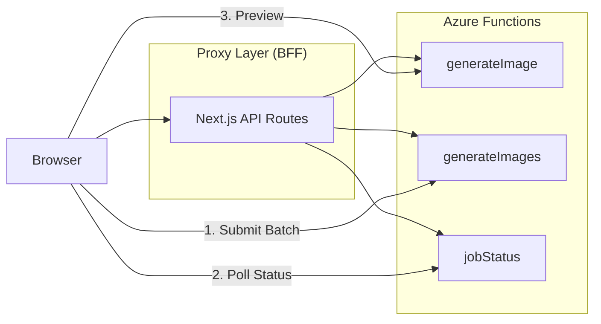

# Frontend Architecture

The frontend is a **Next.js (App Router)** application that provides a real-time editing experience for single images and a high-throughput batch generation interface for bulk creation. It is hosted on **Azure Web Apps (Linux F1 Tier)** and uses a **Proxy Layer** to communicate with the Azure Functions backend, ensuring the client remains decoupled from the serverless infrastructure.

## Core Tech Stack

- **Framework:** Next.js 15+ (App Router)
- **Hosting:** Azure Web Apps (Linux)
- **Infrastructure:** OpenTofu / Terraform (IaC)
- **Styling:** Tailwind CSS + CSS Variables (for dynamic font injection)
- **State:** React Hooks (`useState`, `useMemo`, `useCallback`)
- **Metrics:** Recharts (for analytics visualization)
- **Shared Logic:** `@cover-craft/shared` (Monorepo Workspace)

## System Architecture

The frontend orchestrates two distinct workflows: direct rendering for previews and polling-based retrieval for batch jobs.


```mermaid
graph LR
    Client[Browser] --> Proxy[Next.js API Routes]
    
    subgraph ProxyLayer["Proxy Layer (BFF)"]
        Proxy
    end
    
    subgraph Backend["Azure Functions"]
        Sync[generateImage]
        Async[generateImages]
        Status[jobStatus]
    end

    Proxy --> Sync
    Proxy --> Async
    Proxy --> Status
    
    Client -->|1. Submit Batch| Async
    Client -->|2. Poll Status| Status
    Client -->|3. Preview| Sync
```

## Architectural Patterns

### 1. The Proxy Pattern (BFF)

All client requests to image generation, analytics, or job status endpoints are handled by Next.js route handlers.

- **Benefit:** Hides the Azure Function endpoint, prevents CORS issues, and allows for request/response transformation (e.g., error mapping) before reaching the client.

### 2. Dual-Mode Generation

- **Synchronous (Single):** The `useForm` hook triggers a direct request to the `generateImage` endpoint for instantaneous visual feedback and single-image downloads.
- **Asynchronous (Batch):** The `useBatchForm` hook submits a bulk request to `generateImages`, receives a `jobId`, and initiates a polling lifecycle to track progress until completion.

### 3. Progressive UI Updates

- **Skeleton Loaders:** Standardized across analytics and batch result components to eliminate layout shifts during asynchronous data fetching.
- **Batch Results Display:** Dynamically renders generated assets as they become available via the polling mechanism, providing real-time progress visualization.

## Component Structure

| Type | Examples | Responsibility |
| :--- | :--- | :--- |
| **Pages** | `generate/page.tsx`, `generate/batch/page.tsx`, `analytics/page.tsx` | Entry points for single vs batch generation and dashboards. |
| **Batch UI** | `BatchFormControls`, `BatchResultsDisplay` | Specialized components for bulk parameter configuration and result visualization. |
| **Forms** | `CoverForm`, `FormField` | Encapsulates input logic, contrast validation, and single-image preview synchronization. |
| **UI** | `Button`, `Card`, `Skeleton` | Stateless, reusable atoms styled with Tailwind. |

## Custom Hooks (The Logic Layer)

| Hook | Source | Responsibility |
| :--- | :--- | :--- |
| `useForm` | `hooks/useForm.ts` | Orchestrates single-image state, preview synchronization, and download workflow. |
| `useBatchForm` | `hooks/useBatchForm.ts` | Manages bulk job submission, status polling, and result aggregation. |
| `useContrastCheck` | `hooks/useContrastCheck.ts` | Performs debounced (300ms) WCAG AA compliance checks on color pairs. |

## Data Models

### Batch Job State

```typescript
interface BatchJobState {
  jobId: string | null;
  status: "pending" | "processing" | "completed" | "failed";
  progress: number; // processed / total * 100
  results: Array<{ url: string; fileName: string }>;
  error?: string;
}
```

## Accessibility & Validation

- **WCAG AA Enforced:** Generation buttons (Single and Batch) are programmatically disabled unless contrast ratios meet the ≥ 4.5:1 threshold.
- **Live Regions:** Uses `aria-live="polite"` for batch progress updates to ensure screen readers are notified of background job completion.
- **Focus Management:** Ensures consistent keyboard navigation during the transition from form submission to result display.
