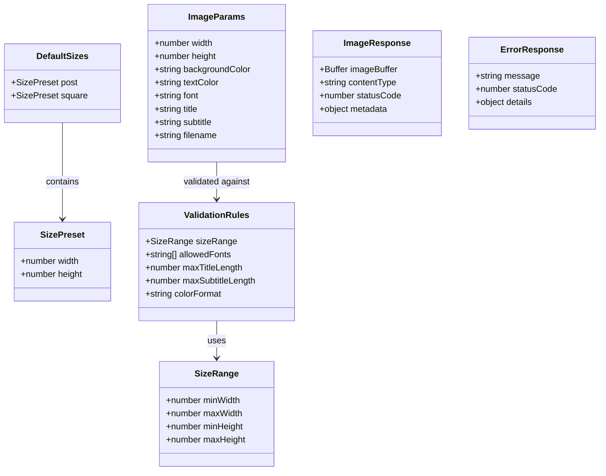
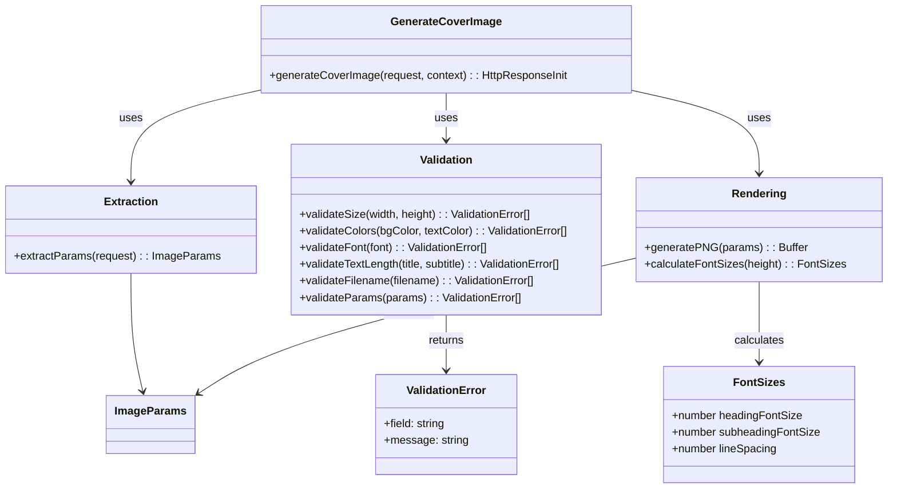
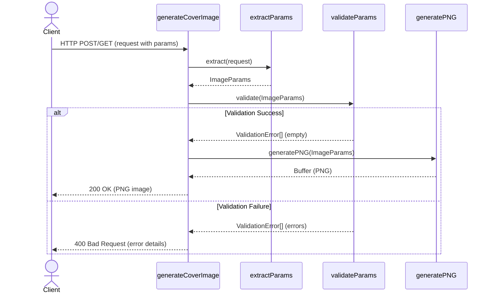
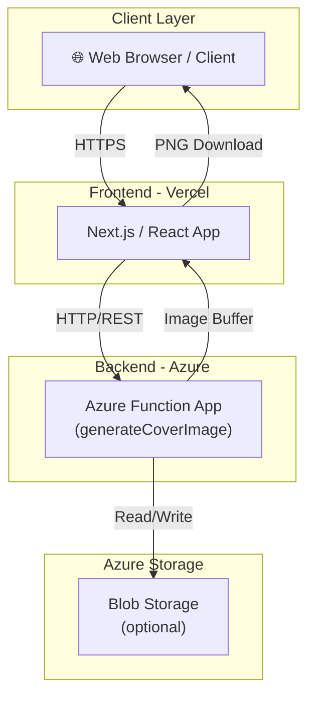

# Backend Architecture

## Overview

The backend is a modular, serverless API built on Azure Functions. It provides endpoints for health checks and dynamic cover image generation, with robust validation and extensibility.

## Key Principles

- **Modular Components**: Extraction, validation, rendering, and response building are separated for maintainability.
- **Server-side Validation**: All inputs are validated on the backend for security and reliability, including WCAG AA contrast checking.
- **Accessibility First**: Color contrast validation ensures all generated images meet accessibility standards.
- **Extensible Design**: Adding new sizes, fonts, or validation rules requires minimal changes.
- **Direct PNG Output**: Images are returned as binary PNG buffers for immediate use.

## Main Endpoints

- `POST /api/generateCoverImage`: Generate a PNG cover image with custom text, colors, font, and size.
- `GET /api/healthCheck`: Check API health and availability.

## Data Flow

1. **Extraction**: Parse and extract parameters from the request.
2. **Validation**: Validate all parameters (size, colors, font, text length) against rules.
3. **Rendering**: Generate the image using validated parameters.
4. **Response**: Return PNG image or error details.

## Core Data Structures



## Functional Architecture



## Sequence Flow



## Deployment Overview



## Font Size Calculations

The backend uses responsive font sizing based on canvas height to ensure optimal readability across different image dimensions.

### Formula (Solution #2)

- **Heading**: `Math.max(32, Math.round(height * 0.09))` - 9% of canvas height with minimum 32px
- **Subheading**: `Math.max(24, Math.round(height * 0.07))` - 7% of canvas height with minimum 24px
- **Line Spacing**: `headingFontSize * 1.2` - Space between heading and subheading

### Size Presets

| Preset | Dimensions | Heading | Subheading |
|--------|-----------|---------|-----------|
| Post | 1200 × 627 | 56px | 44px |
| Square | 1080 × 1080 | 97px | 75px |

This ensures text is:

- Large enough for readability on all presets
- Responsive to different canvas dimensions
- Consistently scaled between backend rendering and frontend preview

## Color Contrast Validation

The backend validates color contrast using the WCAG formula to ensure generated images are accessible.

### Validation Rule

- **WCAG AA Standard**: Contrast ratio ≥ 4.5:1 for normal text
- All generated images must meet this threshold
- Backend rejects requests with insufficient contrast

### Implementation

**Contrast Calculation Process:**

1. Parse hex colors to RGB components: `hexToRgb(color: string)`
2. Calculate relative luminance for each color: `getRelativeLuminance(rgb)`
   - Apply gamma correction using WCAG formula
   - Returns normalized value (0-1 range)
3. Compute contrast ratio: `getContrastRatio(color1, color2)`
   - Formula: `(lighter luminance + 0.05) / (darker luminance + 0.05)`
   - Returns ratio on 1-21 scale
4. Validate against threshold: `validateContrast(bgColor, textColor)`
   - Compares ratio to WCAG AA minimum (4.5:1)
   - Returns validation error if threshold not met

**Error Response Example:**

```json
{
  "status": 400,
  "error": "Validation failed",
  "details": [
    {
      "field": "contrast",
      "message": "Color contrast ratio 2.45:1 does not meet WCAG AA standard (4.5:1). Please choose colors with better contrast."
    }
  ]
}
```

### Testing

**Test Cases:**

- Good contrast: `#000000` (black) on `#ffffff` (white) = 21:1 ✓
- Poor contrast: `#ffff00` (yellow) on `#ffffff` (white) = 1.07:1 ✗
- Boundary: Colors with ratio exactly 4.5:1 ✓
- Edge cases: Dark colors on dark backgrounds, light on light

**Example curl command to trigger validation error:**

```bash
curl -X POST "http://localhost:7071/api/generateCoverImage" \
  -H "Content-Type: application/json" \
  -d '{
    "width": 1200,
    "height": 627,
    "backgroundColor": "#ffffff",
    "textColor": "#ffff00",
    "font": "Montserrat",
    "title": "Poor Contrast Example",
    "subtitle": "This will fail validation!",
    "filename": "test-contrast-fail"
  }'
```
