# Backend Architecture

The backend is a modular, serverless API built on Azure Functions. It provides endpoints for health checks and dynamic cover image generation, with robust validation and extensibility.

## Key Principles

- **Modular Components**: Extraction, validation, rendering, and response building are separated for maintainability.
- **Server-side Validation**: All inputs are validated on the backend for security and reliability, including WCAG AA contrast checking.
- **Accessibility First**: Color contrast validation ensures all generated images meet accessibility standards.
- **Extensible Design**: Adding new sizes, fonts, or validation rules requires minimal changes.
- **Direct PNG Output**: Images are returned as binary PNG buffers for immediate use.

## Architecture Diagrams

### 1. System Architecture (High-Level)

```mermaid
graph TB
    subgraph Cloud["Azure Cloud"]
        subgraph FuncApp["Function App"]
            HC["GET /api/health<br/>Health Check"]
            GCI["POST /api/generateCoverImage<br/>Generate Cover"]
            M["POST /api/metrics<br/>Store Metrics"]
            A["GET /api/analytics<br/>Get Analytics"]
        end
        
        subgraph DB["Data Layer"]
            Mongo["MongoDB<br/>Metrics Collection"]
        end
    end
    
    Client["🌐 Client/Frontend"]
    
    Client -->|Request| HC
    Client -->|Request| GCI
    Client -->|Request| M
    Client -->|Request| A
    
    M -->|Write| Mongo
    A -->|Read| Mongo
    GCI -->|Response: PNG| Client
    HC -->|Response: JSON| Client
    A -->|Response: JSON| Client
    M -->|Response: JSON| Client
```



### 2. Deployment Architecture

```mermaid
graph TB
    subgraph Client["Client Layer"]
        Browser["🌐 Web Browser / Client"]
    end
    
    subgraph Frontend["Frontend - Vercel"]
        FE["Next.js / React App"]
        API["API Routes<br/>(proxy to backend)"]
    end
    
    subgraph Backend["Backend - Azure Functions"]
        GCI["generateCoverImage"]
        HC["health"]
        M["metrics"]
        A["analytics"]
    end
    
    subgraph Database["MongoDB"]
        MetricsDB["Metrics Collection"]
    end
    
    Browser -->|HTTPS| FE
    FE -->|HTTP/REST| API
    API -->|proxy| GCI
    API -->|proxy| HC
    API -->|proxy| M
    API -->|proxy| A
    M -->|write| MetricsDB
    A -->|read| MetricsDB
    GCI -->|PNG Buffer| API
    API -->|PNG| FE
    FE -->|PNG Download| Browser
```



## Data Flow Details

### Image Generation Flow

1. **Extraction**: Parse and extract parameters from the request.
2. **Validation**: Validate all parameters (size, colors, font, text length) against rules.
3. **Rendering**: Generate the image using validated parameters.
4. **Response**: Return PNG image or error details.

### Metrics Flow

1. **Receive**: Frontend sends metrics data (event, timestamp, performance data).
2. **Validate**: Verify required fields (event, timestamp).
3. **Store**: Save to MongoDB for persistence.
4. **Response**: Confirm storage success.

### Analytics Flow

1. **Connect**: Establish MongoDB connection.
2. **Aggregate**: Execute multi-stage aggregation pipeline on metrics collection:
   - **User Engagement**: Total clicks, generate/download counts, unique users (by sessionId), conversion rate
   - **Trends**: Daily/hourly activity, subtitle usage over time (last 30 days and 12 months)
   - **Feature Popularity**: Font usage distribution, size distribution, title length statistics
   - **Accessibility**: WCAG level distribution, contrast ratio stats, failure rate calculation
   - **Performance**: Backend/client duration percentiles (P50, P95, P99), network latency, duration by image size
3. **Transform**: Calculate aggregated metrics and format for dashboard display.
4. **Response**: Return comprehensive analytics data (non-sensitive, safe for public).

### Data Structures


### Component Interactions


## Generate Cover Image System

### Endpoint (`POST /api/generateCoverImage`)

**Purpose**: Generate a PNG cover image with custom text, colors, font, and size.

**Request Body**:

```json
{
  "width": 1200,
  "height": 627,
  "backgroundColor": "#ffffff",
  "textColor": "#000000",
  "font": "Montserrat",
  "title": "Cover Title",
  "subtitle": "Subtitle text",
  "filename": "my-cover"
}
```

**Response** (Success - 200 OK):

- Content-Type: `image/png`
- Body: PNG image buffer

**Response** (Validation Error - 400 Bad Request):

```json
{
  "status": 400,
  "error": "Validation failed",
  "details": [
    {
      "field": "contrast",
      "message": "Color contrast ratio does not meet WCAG AA standard"
    }
  ]
}
```

**Validation Rules**:

- Image dimensions: width (200-3840px), height (200-2160px)
- Fonts: Montserrat, Roboto, Playfair Display
- Text length: title (1-100 chars), subtitle (0-150 chars)
- Color contrast: WCAG AA minimum (4.5:1 ratio)

### Image Generation Sequence Flow


### Color Contrast Validation

The backend validates color contrast using the WCAG formula to ensure generated images are accessible.

#### Validation Rule

- **WCAG AA Standard**: Contrast ratio ≥ 4.5:1 for normal text
- All generated images must meet this threshold
- Backend rejects requests with insufficient contrast

#### Implementation

**Contrast Calculation Process:**

1. Parse hex colors to RGB components: `hexToRgb(color: string)`
2. Calculate relative luminance for each color: `getRelativeLuminance(rgb)`
   - Apply gamma correction using WCAG formula
   - Returns normalized value (0-1 range)
3. Compute contrast ratio: `getContrastRatio(color1, color2)`
   - Formula: `(lighter luminance + 0.05) / (darker luminance + 0.05)`
   - Returns ratio on 1-21 scale
4. Validate against threshold: `validateContrast(bgColor, textColor)`
   - Compares ratio to WCAG AA minimum (4.5:1)
   - Returns validation error if threshold not met

**Error Response Example:**

```json
{
  "status": 400,
  "error": "Validation failed",
  "details": [
    {
      "field": "contrast",
      "message": "Color contrast ratio 2.45:1 does not meet WCAG AA standard (4.5:1). Please choose colors with better contrast."
    }
  ]
}
```

#### Testing

**Test Cases:**

- Good contrast: `#000000` (black) on `#ffffff` (white) = 21:1 ✓
- Poor contrast: `#ffff00` (yellow) on `#ffffff` (white) = 1.07:1 ✗
- Boundary: Colors with ratio exactly 4.5:1 ✓
- Edge cases: Dark colors on dark backgrounds, light on light

**Example curl command to trigger validation error:**

```bash
curl -X POST "http://localhost:7071/api/generateCoverImage" \
  -H "Content-Type: application/json" \
  -d '{
    "width": 1200,
    "height": 627,
    "backgroundColor": "#ffffff",
    "textColor": "#ffff00",
    "font": "Montserrat",
    "title": "Poor Contrast Example",
    "subtitle": "This will fail validation!",
    "filename": "test-contrast-fail"
  }'
```

## Metrics & Analytics System

### Metrics Endpoint (`POST /api/metrics`)

**Purpose**: Receive event data from the frontend and persist to MongoDB.

**Request Body**:

```json
{
  "event": "cover_generation",
  "timestamp": "2025-12-05T10:30:00Z",
  "status": "success",
  "sizePreset": "post",
  "font": "Montserrat",
  "titleLength": 25,
  "subtitleLength": 50,
  "hasSubtitle": true,
  "contrastRatio": 12.5,
  "wcagLevel": "AAA",
  "duration": 245,
  "clientDuration": 120,
  "networkLatency": 42,
  "sessionId": "sess_abc123xyz"
}
```

**Response**:

```json
{
  "status": 201,
  "body": {
    "success": true,
    "message": "Metrics stored successfully"
  }
}
```

**Validation Rules**:

- `event` and `timestamp` are required fields
- `status` must be one of: "success", "error", "validation_error"
- `sizePreset`, `font`, `titleLength`, `subtitleLength` track feature usage
- `contrastRatio` and `wcagLevel` track accessibility metrics
- `duration`, `clientDuration`, `networkLatency` track performance metrics
- `sessionId` groups metrics by user session (no personal data)
- All metrics are stored to MongoDB for historical analysis and aggregation

### Analytics Endpoint (`GET /api/analytics`)

**Purpose**: Fetch aggregated, non-sensitive analytics data for dashboard display.

**Response** (Comprehensive):

```json
{
  "status": 200,
  "body": {
    "success": true,
    "data": {
      "userEngagement": {
        "totalClicks": 3420,
        "generateCount": 2150,
        "downloadCount": 1270,
        "uniqueUsers": 487,
        "conversionRate": 59.1
      },
      "dailyTrends": [
        {"date": "2025-12-13", "generates": 145, "downloads": 87},
        {"date": "2025-12-12", "generates": 162, "downloads": 98}
      ],
      "monthlyTrends": [
        {"month": "Dec", "generates": 2150, "downloads": 1270},
        {"month": "Nov", "generates": 1980, "downloads": 1180}
      ],
      "hourlyTrend": [
        {"hour": "0", "count": 45},
        {"hour": "1", "count": 32}
      ],
      "featurePopularity": {
        "fontDistribution": [
          {"font": "Montserrat", "count": 892},
          {"font": "Roboto", "count": 756}
        ],
        "sizeDistribution": [
          {"size": "post", "count": 1247},
          {"size": "square", "count": 903}
        ],
        "titleLengthStats": {
          "avgTitleLength": 28.5,
          "minTitleLength": 1,
          "maxTitleLength": 100
        },
        "subtitleUsagePercent": 76.5
      },
      "accessibilityCompliance": {
        "wcagDistribution": [
          {"level": "A", "count": 124},
          {"level": "AA", "count": 1856},
          {"level": "AAA", "count": 170},
          {"level": "FAIL", "count": 0}
        ],
        "contrastStats": {
          "avgContrastRatio": 8.7,
          "minContrastRatio": 4.5,
          "maxContrastRatio": 21
        },
        "wcagFailurePercent": 0,
        "wcagTrend": [
          {"date": "2025-12-13", "A": 12, "AA": 198, "AAA": 15, "FAIL": 0}
        ]
      },
      "performanceMetrics": {
        "backendPerformance": {
          "avgBackendDuration": 234,
          "p95BackendDuration": 412,
          "p99BackendDuration": 567,
          "backendDurationTrend": [
            {"date": "2025-12-13", "p50": 210, "p95": 398, "p99": 545}
          ]
        },
        "clientPerformance": {
          "avgClientDuration": 156,
          "p95ClientDuration": 287,
          "p99ClientDuration": 401,
          "clientDurationTrend": [
            {"date": "2025-12-13", "p50": 145, "p95": 267, "p99": 380}
          ]
        },
        "networkLatency": {
          "avgNetworkLatency": 45,
          "minNetworkLatency": 8,
          "maxNetworkLatency": 234
        },
        "performanceBySize": [
          {"size": "post", "avgBackendDuration": 240, "avgClientDuration": 158, "count": 1247},
          {"size": "square", "avgBackendDuration": 225, "avgClientDuration": 153, "count": 903}
        ]
      }
    }
  }
}
```

**Data Privacy**:

- Only aggregated summary statistics are exposed
- Individual user interactions are not revealed
- Metrics are safe for public consumption
- No personally identifiable information is included

### Data Storage

All metrics are persisted in MongoDB with the following structure:

- **Collection**: `metrics`
- **Indexes**: Timestamp (for efficient querying), Event type
- **Retention**: Unlimited (for historical analysis)
- **Access**: Backend only (not directly accessible from frontend)

### Metrics Collection Sequence Flow


### Analytics Dashboard Display Sequence Flow


