# Backend Architecture

## Overview

The backend is a modular, serverless API built on Azure Functions. It provides endpoints for health checks and dynamic cover image generation, with robust validation and extensibility.

## Key Principles

- **Modular Components**: Extraction, validation, rendering, and response building are separated for maintainability.
- **Server-side Validation**: All inputs are validated on the backend for security and reliability.
- **Extensible Design**: Adding new sizes, fonts, or validation rules requires minimal changes.
- **Direct PNG Output**: Images are returned as binary PNG buffers for immediate use.

## Main Endpoints

- `POST /api/generateCoverImage`: Generate a PNG cover image with custom text, colors, font, and size.
- `GET /api/healthCheck`: Check API health and availability.

## Data Flow

1. **Extraction**: Parse and extract parameters from the request.
2. **Validation**: Validate all parameters (size, colors, font, text length) against rules.
3. **Rendering**: Generate the image using validated parameters.
4. **Response**: Return PNG image or error details.

## Core Data Structures

## Functional Architecture

## Sequence Flow

## Deployment Overview

```mermaid
graph TB
    subgraph Client["Client Layer"]
        Browser["🌐 Web Browser / Client"]
    end
    
    subgraph Frontend["Frontend - Vercel"]
        FE["Next.js / React App"]
    end
    
    subgraph Backend["Backend - Azure"]
        FA["Azure Function App<br/>(generateCoverImage)"]
    end
    
    subgraph Storage["Azure Storage"]
        Blob["Blob Storage<br/>(optional)"]
    end
    
    Browser -->|HTTPS| FE
    FE -->|HTTP/REST| FA
    FA -->|Read/Write| Blob
    FA -->|Image Buffer| FE
    FE -->|PNG Download| Browser
```

## Font Size Calculations

The backend uses responsive font sizing based on canvas height to ensure optimal readability across different image dimensions.

### Formula (Solution #2)

- **Heading**: `Math.max(32, Math.round(height * 0.09))` - 9% of canvas height with minimum 32px
- **Subheading**: `Math.max(24, Math.round(height * 0.07))` - 7% of canvas height with minimum 24px
- **Line Spacing**: `headingFontSize * 1.2` - Space between heading and subheading

### Size Presets

| Preset | Dimensions | Heading | Subheading |
|--------|-----------|---------|-----------|
| Post | 1200 × 627 | 56px | 44px |
| Square | 1080 × 1080 | 97px | 75px |

This ensures text is:

- Large enough for readability on all presets
- Responsive to different canvas dimensions
- Consistently scaled between backend rendering and frontend preview
