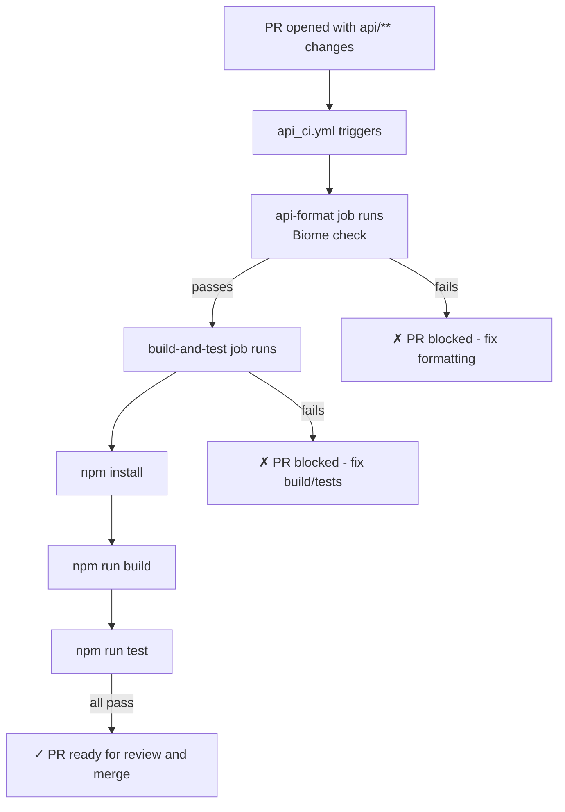
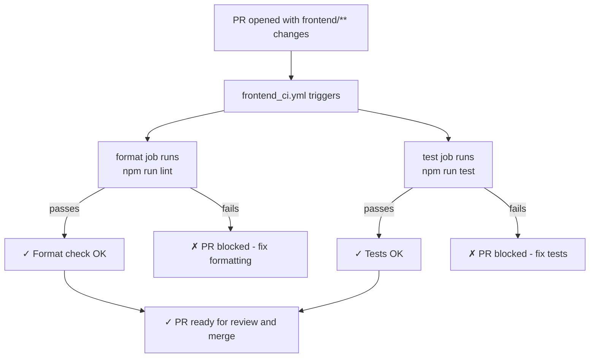
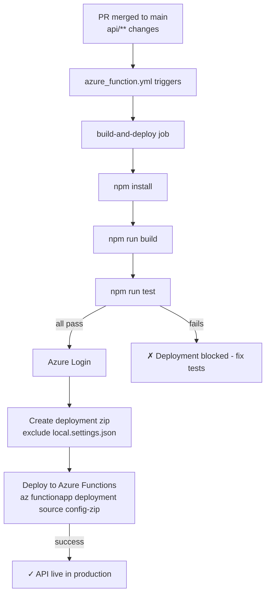

# DevOps Practices

This document outlines all DevOps workflows, CI/CD pipelines, and automation practices used in the Cover Craft project.

## Overview

The project uses GitHub Actions for continuous integration and deployment. All workflows use path-based triggering to optimize CI/CD execution and ensure workflows only run when relevant files change.

## Workflow Architecture

### Path-Based Triggering

All workflows use path filters for intelligent triggering:

- **API workflows**: Trigger on `api/**` changes
- **Frontend workflows**: Trigger on `frontend/**` changes
- **Markdown workflows**: Trigger on `**/*.md` changes

This approach:
- Reduces unnecessary workflow runs
- Saves CI/CD minutes and time
- Provides faster feedback to developers
- Keeps concerns separated and organized

## Active Workflows

### 1. API - Format, Build & Test (`api_ci.yml`)

**Purpose**: Validates API code formatting, builds successfully, and all tests pass on pull requests.

**Trigger**: Pull requests to `main` branch with changes in `api/**`

**Environment Variables**:
- `AZURE_FUNCTIONAPP_PACKAGE_PATH`: `api/`
- `NODE_VERSION`: `22.x`

**Jobs**:

#### api-format
- Runs Biome format check using custom reusable action
- Validates code formatting consistency
- Must pass before build-and-test job runs

#### build-and-test
- Depends on: `api-format` (sequential execution)
- Install dependencies via npm
- Build project (`npm run build`)
- Run all tests (`npm run test -- --run`)
- Ensures no broken code reaches main branch

**Key Features**:
- Sequential job execution ensures format check passes first
- Comprehensive test coverage validation
- TypeScript compilation verification
- Required check before merge

---

### 2. Frontend - Format & Test (`frontend_ci.yml`)

**Purpose**: Validates frontend code formatting and runs unit tests on pull requests.

**Trigger**: Pull requests with changes in `frontend/**`

**Environment Variables**:
- `NODE_VERSION`: `22.x`

**Jobs**:

#### format
- Install dependencies via npm ci
- Run Biome linting (`npm run lint`)
- Validates code quality and formatting

#### test
- Install dependencies via npm ci
- Run unit tests (`npm run test`)
- Validates application functionality

**Key Features**:
- Parallel job execution (both jobs run simultaneously)
- Uses npm ci for reproducible builds
- Fast feedback loop for frontend developers
- Required check before merge

---

### 3. Function App Deployment (`azure_function.yml`)

**Purpose**: Automatically deploys API to Azure Functions on merge to main.

**Trigger**:
- Push to `main` branch with changes in `api/**`
- Manual dispatch (`workflow_dispatch`)

**Environment Variables**:
- `AZURE_FUNCTIONAPP_NAME`: `cover-craft`
- `AZURE_FUNCTIONAPP_PACKAGE_PATH`: `api/`
- `NODE_VERSION`: `22.x`

**Job**: build-and-deploy

**Steps**:
1. Checkout code
2. Setup Node.js 22.x
3. Install dependencies, build, and run tests
4. Azure Login using service principal
5. Create deployment zip (excludes `local.settings.json`)
6. Deploy to Azure Functions using Azure CLI

**Deployment Command**:
```bash
az functionapp deployment source config-zip \
  --name {{ AZURE_FUNCTIONAPP_NAME }} \
  --resource-group personal-projects \
  --src ../deploy.zip
```

**Key Features**:
- Automated deployment on merge (no manual steps required)
- Excludes sensitive configuration files from deployment zip
- Runs full test suite before deployment validation
- Uses Azure service principal credentials from GitHub secrets
- Zero-downtime deployment
- Manual dispatch option for emergency deployments

**Required GitHub Secrets**:
- `AZURE_CREDENTIALS`: Azure service principal credentials (JSON format with clientId, clientSecret, subscriptionId, tenantId)

---

### 4. Markdown Linter (`markdownlint.yml`)

**Purpose**: Ensures consistent markdown formatting and validates documentation files.

**Trigger**:
- Pull requests to `main` branch with changes in `**/*.md`
- Manual dispatch (`workflow_dispatch`)

**Job**: markdownlint

**Steps**:
1. Checkout code
2. Run markdown linting on all `.md` files

**Key Features**:
- Uses custom reusable action: `victoriacheng15hub/platform-actions/markdown-linter@main`
- Maintains documentation quality standards
- Enforces markdown best practices
- Catches formatting issues before merge

---

## CI/CD Pipeline Flow

### Pull Request Flow (API)



### Pull Request Flow (Frontend)



### Deployment Flow (API)


