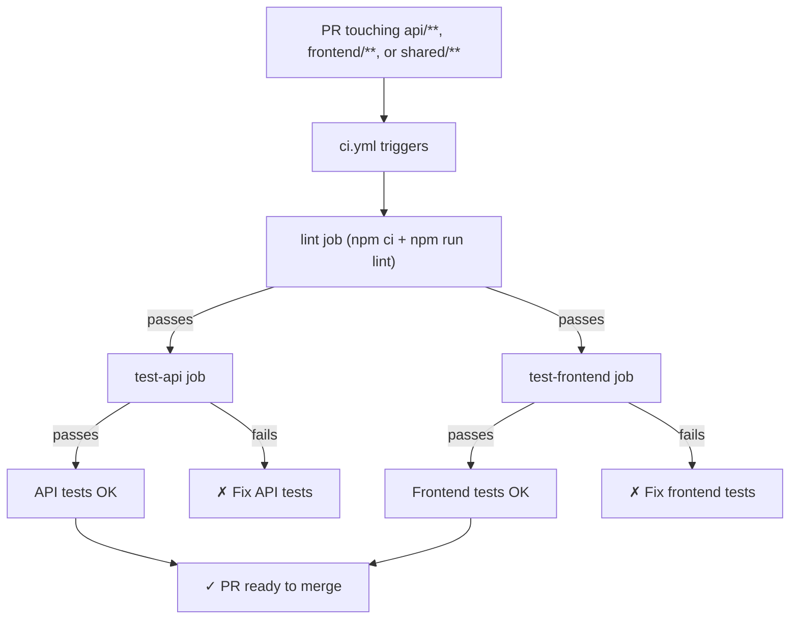
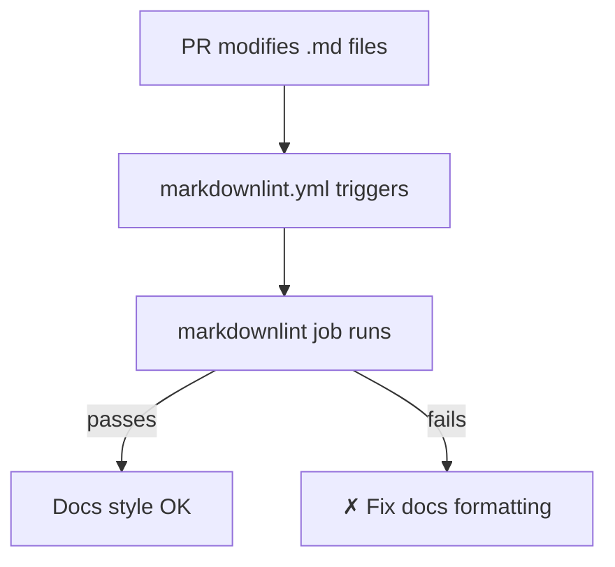
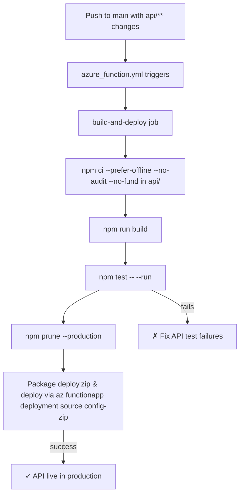

# DevOps Practices

This document outlines all DevOps workflows, CI/CD pipelines, and automation practices used in the Cover Craft project.

## Overview

The project uses GitHub Actions for continuous integration and deployment. All workflows use path-based triggering to optimize CI/CD execution and ensure workflows only run when relevant files change.

## Workflow Architecture

### Path-Based Triggering

Workflows rely on path filters so CI/CD only runs when relevant directories change:

- Pull requests or pushes that touch `api/**`, `frontend/**`, or `shared/**` fire the `CI - Lint & Test` workflow.
- Direct pushes to `main` touching `api/**` drive the `Function App Deployment` workflow.
- Any change under `**/*.md` triggers the `Markdown Linter` workflow.

This keeps each pipeline fast and scoped to the code it needs to verify.

## Active Workflows

### 1. CI - Lint & Test (`ci.yml`)

**Purpose**: Runs root linting/formatting checks, then executes package-specific test suites for both API and frontend, all from the repo root.

**Trigger**: PRs or pushes to `main` that include changes in `api/**`, `frontend/**`, or `shared/**`; manual dispatch allowed.

**Environment Variables**:

- `NODE_VERSION`: `24` (used by all jobs)

**Jobs**:

#### lint

- Runs on `ubuntu-latest`, installs Node 24, checks out the repository, runs `npm ci`, then executes `npm run lint` from the root.
- Succeeds before downstream tests can run, ensuring style issues are addressed first.

#### test-api

- Depends on `lint`, repeats checkout/setup, runs `npm ci`, then invokes `npm run test --prefix api` so the API suite uses its local dependencies.

#### test-frontend

- Depends on `lint`, repeats setup, runs `npm ci`, and executes `npm run test --prefix frontend`, covering the frontend Vitest suite.

**Key Features**:

1. **Centralized linting** keeps formatting consistent across all packages.
2. **Package-targeted tests** still run with their own lockfiles via `--prefix` without duplicating scripts.
3. **Job dependencies** (lint → tests) prevent expensive test runs if formatting already fails.

---

### 3. Function App Deployment (`azure_function.yml`)

**Purpose**: Automatically deploys API to Azure Functions on merge to main.

**Trigger**:

- Push to `main` branch with changes in `api/**`
- Manual dispatch (`workflow_dispatch`)

**Environment Variables**:

- `AZURE_FUNCTIONAPP_NAME`: `cover-craft`
- `AZURE_FUNCTIONAPP_PACKAGE_PATH`: `api/`
- `NODE_VERSION`: `22.x`

**Job**: build-and-deploy

**Steps**:

1. Checkout code
2. Setup Node.js 22.x
3. Install dependencies, build, and run tests
4. Azure Login using service principal
5. Create deployment zip (excludes `local.settings.json`)
6. Deploy to Azure Functions using Azure CLI

**Deployment Command**:

```bash
az functionapp deployment source config-zip \
  --name {{ AZURE_FUNCTIONAPP_NAME }} \
  --resource-group personal-projects \
  --src ../deploy.zip
```

**Key Features**:

1. Automated deployments on merge, plus manual dispatch support.
2. Installs dependencies with caching/offline flags, builds, runs tests, then prunes devDependencies before deploying.
3. Uses `az functionapp deployment source config-zip` to upload a zip that excludes `local.settings.json`.
4. Logs deployment info (zip contents, completion timestamp) for traceability.

**Required GitHub Secrets**:

- `AZURE_CREDENTIALS`: Azure service principal credentials for `azure/login@v2.3.0`.

---

### 4. Markdown Linter (`markdownlint.yml`)

**Purpose**: Validates documentation formatting for every PR that touches Markdown.

**Trigger**:

- Pull requests to `main` changing `**/*.md`
- Manual dispatch

**Job**: `markdownlint`

**Steps**:

1. Checkout the repository.
2. Run `victoriacheng15hub/platform-actions/markdown-linter@main` with `md_paths: '**/*.md'`.

**Key Features**:

- Keeps docs styling consistent with a reusable action.
- Runs quickly because it only inspects Markdown files.
- Prevents textual/formatting regressions from slipping into `main`.

---

## CI/CD Pipeline Flow

### Pull Request Flow (Lint & Test)



### Pull Request Flow (Markdown)



### Deployment Flow (API)


