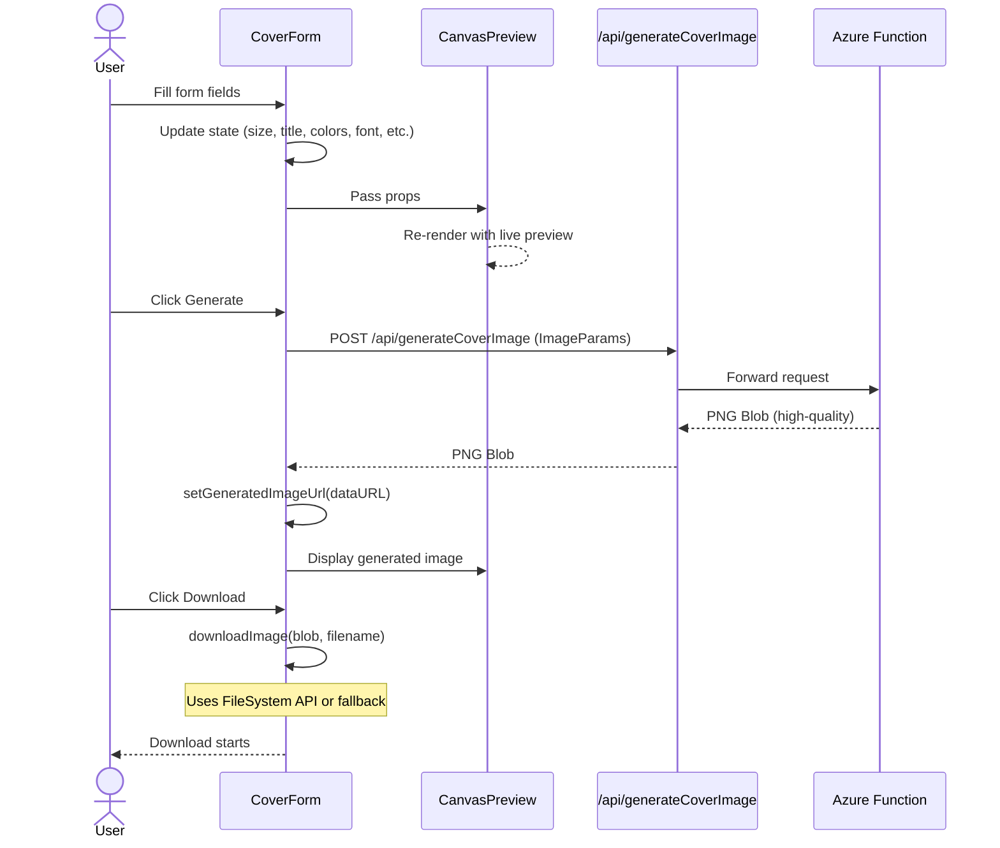

# Frontend Architecture

## Overview

A modular React/Next.js application for generating custom cover images with real-time preview and seamless backend API integration. The frontend provides an intuitive two-column layout (form on left, live preview on right) with responsive behavior for mobile devices.

## Highlights

- **Real-time Preview**: Form state updates immediately reflect in the preview area.
- **Modular Components**: Form, layout, UI elements, and preview are separated for maintainability and testability.
- **Server-side Generation**: Final high-quality images are generated by the Azure Functions backend.
- **Progressive Enhancement**: Modern FileSystem API with fallback to legacy download methods for browser compatibility.
- **Responsive Design**: Two-column layout on desktop; single-column stacked layout on mobile.
- **Font Integration**: Built-in support for 5 Google Fonts (Montserrat, Roboto, Lato, Playfair Display, Open Sans) with CSS variable mapping.

## System Wireframe

### Layout Structure

```text
┌─────────────────────────────────────────────────────────────┐
│                          HEADER                             │
│  ┌──────────────────────────────────────────────────────┐   │
│  │              Cover Craft 🎨                          │   │
│  └──────────────────────────────────────────────────────┘   │
└─────────────────────────────────────────────────────────────┘

┌─────────────────────────────────────────────────────────────┐
│                           MAIN                              │
│                                                             │
│  ┌────────────────────────┐  ┌──────────────────────────┐   │
│  │                        │  │                          │   │
│  │   FORM SECTION (50%)   │  │  PREVIEW SECTION (50%)   │   │
│  │                        │  │                          │   │
│  │  ┌──────────────────┐  │  │  ┌────────────────────┐  │   │
│  │  │Size Preset       │  │  │  │                    │  │   │
│  │  └──────────────────┘  │  │  │   LIVE PREVIEW     │  │   │
│  │                        │  │  │                    │  │   │
│  │  ┌──────────────────┐  │  │  │  [Canvas Preview]  │  │   │
│  │  │File Name         │  │  │  │                    │  │   │
│  │  └──────────────────┘  │  │  │  Updates real-time │  │   │
│  │                        │  │  │                    │  │   │
│  │  ┌──────────────────┐  │  │  │  Displays title,   │  │   │
│  │  │Title             │  │  │  │  subtitle, with    │  │   │
│  │  └──────────────────┘  │  │  │  selected colors   │  │   │
│  │                        │  │  │  and font          │  │   │
│  │  ┌──────────────────┐  │  │  │                    │  │   │
│  │  │Subtitle          │  │  │  └────────────────────┘  │   │
│  │  └──────────────────┘  │  │                          │   │
│  │                        │  └──────────────────────────┘   │
│  │  ┌─────────┬─────────┐ │                                 │
│  │  │BG Color │TX Color │ │  Mobile: Stacked vertically     │
│  │  └─────────┴─────────┘ │  - Form at top (full width)     │
│  │                        │  - Preview below (full width)   │
│  │  ┌──────────────────┐  │                                 │
│  │  │Font              │  │                                 │
│  │  └──────────────────┘  │                                 │
│  │                        │                                 │
│  │  ┌───────────┬────────┐│                                 │
│  │  │ Generate  │ Reset  ││                                 │
│  │  └───────────┴────────┘│                                 │
│  │                        │                                 │
│  └────────────────────────┘                                 │
│                                                             │
└─────────────────────────────────────────────────────────────┘

┌─────────────────────────────────────────────────────────────┐
│                          FOOTER                             │
│  ┌──────────────────────────────────────────────────────┐   │
│  │     © 2025 Victoria Cheng | GitHub                  │   │
│  └──────────────────────────────────────────────────────┘   │
└─────────────────────────────────────────────────────────────┘
```

### Responsive Behavior

**Desktop (> 768px)**: Two-column layout (form 50% | preview 50%) with equal width distribution.

**Mobile (< 768px)**: Single-column stacked layout. Form section at top (full width), preview section below (full width).

## Component Breakdown

The application is organized into modular, reusable components:

### Layout Components

- **`MainLayout`**: Wraps the entire page structure (header, main content, footer). Provides consistent layout and styling.
- **`Header`**: Displays "Cover Craft 🎨" centered with minimal design.
- **`Footer`**: Displays copyright year and GitHub link, centered.

### Form & Input Components

- **`CoverForm`**: Main form component managing all user inputs and form state. Handles generation and download logic.
  - Imports Google Fonts (Montserrat, Roboto, Lato, Playfair Display, Open Sans)
  - Maps font selections to CSS variables for live preview rendering
  - State: size, filename, title, subtitle, backgroundColor, textColor, font, isGenerating, error
  - Buttons: Generate (disabled until title field filled), Reset (always enabled, clears form), Download (appears after generation)

- **`FormField`**: Reusable wrapper component for form inputs with label and optional description text.

- **UI Input Components**:
  - `Input`: Text input field
  - `Select`: Dropdown selection
  - `ColorPicker`: Color picker input
  - `Button`: Clickable button with loading states
  - `Card`: Container for form and preview sections
  - `SectionTitle`: Section header text

### Preview Components

- **`CanvasPreview`**: Displays live preview while editing or generated image after API call.
  - Live Preview: Shows real-time rendering of form inputs using inline styles and CSS variables.
  - Generated Preview: Displays final high-quality PNG image from backend after generation.

## Data Model

### Core Data Structures

```typescript
// User input parameters (mirrors backend ImageParams)
interface ImageParams {
  width: number;                 // Canvas width (1200 or 1080)
  height: number;                // Canvas height (627 or 1080)
  backgroundColor: string;       // Hex color (e.g., #374151)
  textColor: string;             // Hex color (e.g., #F9FAFB)
  font: string;                  // Font name (must be one of FONT_OPTIONS)
  title: string;                 // Main title text (max 55 chars)
  subtitle?: string;             // Subtitle text (max 120 chars, optional)
  filename: string;              // Filename without extension
}

// Size preset options
interface SizePreset {
  label: string;                 // Display label (e.g., "Post (1200 × 627)")
  width: number;
  height: number;
}

// Form state
interface FormState {
  size: string;                  // Selected size preset label
  filename: string;              // Filename without extension (optional)
  title: string;                 // Main title text (required)
  subtitle?: string;             // Subtitle text (optional)
  backgroundColor: string;
  textColor: string;
  font: string;
  isGenerating: boolean;         // Loading state during API call
  error: string | null;          // Error message if generation fails
  generatedImageUrl: string | null;  // Data URL of generated image
}

// API response
type ImageResponse = Blob;       // PNG image as Blob
```

### Available Options

**Size Presets:**

- `"Post (1200 × 627)"` - Standard social media post format
- `"Square (1080 × 1080)"` - Square social media tile format

**Font Options:**

- Montserrat
- Roboto
- Lato
- Playfair Display
- Open Sans

**Colors:** Any valid hex color (3 or 6 digit format, e.g., `#fff` or `#ffffff`)

## API Integration

### Main Endpoints

- **`POST /api/generateCoverImage`**: Next.js route handler that proxies to Azure Functions backend.
  - Request body: `ImageParams` (JSON)
  - Response: PNG image blob
  - Error response: `{ error: string, details?: object }`

- **`GET /api/healthCheck`**: Check API health and availability.
  - Response: `{ status: "ok", timestamp: number }`

### API Library (`lib/api.ts`)

```typescript
// Generate cover image
async function generateCoverImage(params: ImageParams): Promise<Blob>

// Download image with FileSystem API fallback
async function downloadImage(blob: Blob, filename: string): Promise<void>

// Health check
async function healthCheck(): Promise<HealthCheckResponse>
```

## Functional Flow

### User Journey

1. User lands on page → sees empty form and live preview area
2. User enters title/subtitle → preview updates in real-time
3. User customizes colors, fonts, size → preview reflects all changes live
4. User clicks "Generate" button → form state sent to backend API
5. Backend generates high-quality PNG image → returned to frontend
6. User sees "Generated Image" preview with download button
7. User clicks "Download" → FileSystem API or fallback download triggered
8. Image saved as `{filename}-{timestamp}.png`

### Sequence Diagram



## Accessibility Standards

Built with accessibility support in mind. The app includes:

- **Semantic HTML & ARIA**: All form inputs use proper `<label>` elements, error messages have `role="alert"` with `aria-live="polite"`, preview areas use `role="img"` with descriptive labels, form sections have `aria-label` attributes, button loading states use `aria-busy`
- **Keyboard Navigation**: All interactive elements (inputs, selects, color pickers, buttons) are fully keyboard accessible with logical tab order and no keyboard traps
- **Color & Contrast**: Text colors meet WCAG AA contrast ratios, color pickers are always paired with text labels so information isn't conveyed by color alone
- **Screen Reader Support**: Error messages are announced via `role="alert"`, loading states are announced via `aria-busy`, image alt text is descriptive (e.g., "Generated cover image: {title}"), form fields have descriptive `aria-label` attributes
- **Focus Indicators**: All interactive elements have visible focus rings with `focus:ring-2` styling

## Extensibility

**Adding a New Size Preset:**

1. Add to `SIZE_PRESETS` array in `CoverForm.tsx`
2. Update backend `ALLOWED_SIZES` to match

**Adding a New Font:**

1. Import from `next/font/google` in `CoverForm.tsx`
2. Add to `FONT_OPTIONS` array
3. Add mapping to `fontFamilyMap`
4. Register font in backend (`generateCoverImage.ts`)
5. Update backend `ALLOWED_FONTS` list

**Adding Form Validation:**

- Currently: Only `title` field is required to enable Generate button
- Add regex validation for `filename`, `title`, `subtitle` as needed
- Ensure error messages are associated with form fields via `aria-describedby`

## Potential Future Enhancements

- **Template Presets**: Pre-built templates (Blog, YouTube, Social Media, Newsletter)
- **Save/Load Designs**: LocalStorage or cloud backend to persist design drafts
- **Image Upload**: Allow custom background images instead of solid colors
- **Advanced Text Styling**: Text shadows, outlines, gradients, opacity
- **Additional Formats**: Story size (1080×1920), banner (1600×400), custom dimensions
- **Design History**: Track and restore previous designs
- **Batch Generation**: Generate multiple variations with different text
- **Export Options**: SVG, PDF, or other formats beyond PNG
- **Dark Mode**: Add dark theme with proper color contrast maintenance
- **Internationalization**: Support multiple languages with ARIA translations
