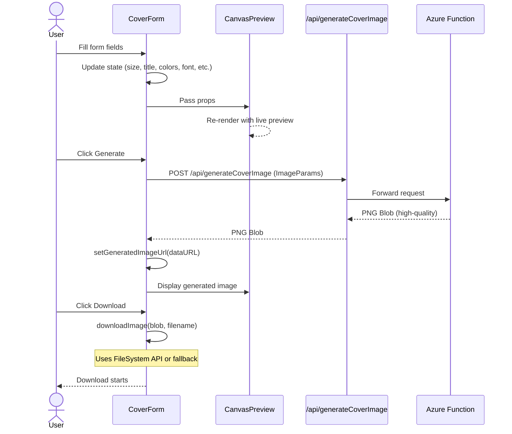

# Frontend Architecture

## Overview

A modular React/Next.js application for generating custom cover images with real-time preview and seamless backend API integration. The frontend provides an intuitive two-column layout (form on left, live preview on right) with responsive behavior for mobile devices.

## Highlights

- **Real-time Preview**: Form state updates immediately reflect in the preview area.
- **Modular Components**: Form, layout, UI elements, and preview are separated for maintainability and testability.
- **Color Contrast Validation**: WCAG AA compliance checking (4.5:1 ratio) with real-time visual feedback and debounced calculations for performance.
- **Server-side Generation**: Final high-quality images are generated by the Azure Functions backend.
- **Progressive Enhancement**: Modern FileSystem API with fallback to legacy download methods for browser compatibility.
- **Responsive Design**: Two-column layout on desktop; single-column stacked layout on mobile.
- **Font Integration**: Built-in support for 5 Google Fonts (Montserrat, Roboto, Lato, Playfair Display, Open Sans) with CSS variable mapping.

## System Wireframe

### Layout Structure

```text
┌─────────────────────────────────────────────────────────────┐
│                          HEADER                             │
│  ┌──────────────────────────────────────────────────────┐   │
│  │              Cover Craft 🎨                          │   │
│  └──────────────────────────────────────────────────────┘   │
└─────────────────────────────────────────────────────────────┘

┌─────────────────────────────────────────────────────────────┐
│                           MAIN                              │
│                                                             │
│  ┌────────────────────────┐  ┌──────────────────────────┐   │
│  │                        │  │                          │   │
│  │   FORM SECTION (50%)   │  │  PREVIEW SECTION (50%)   │   │
│  │                        │  │                          │   │
│  │  ┌──────────────────┐  │  │  ┌────────────────────┐  │   │
│  │  │Size Preset       │  │  │  │                    │  │   │
│  │  └──────────────────┘  │  │  │   LIVE PREVIEW     │  │   │
│  │                        │  │  │                    │  │   │
│  │  ┌──────────────────┐  │  │  │  [Canvas Preview]  │  │   │
│  │  │File Name         │  │  │  │                    │  │   │
│  │  └──────────────────┘  │  │  │  Updates real-time │  │   │
│  │                        │  │  │                    │  │   │
│  │  ┌──────────────────┐  │  │  │  Displays title,   │  │   │
│  │  │Title             │  │  │  │  subtitle, with    │  │   │
│  │  └──────────────────┘  │  │  │  selected colors   │  │   │
│  │                        │  │  │  and font          │  │   │
│  │  ┌──────────────────┐  │  │  │                    │  │   │
│  │  │Subtitle          │  │  │  └────────────────────┘  │   │
│  │  └──────────────────┘  │  │                          │   │
│  │                        │  └──────────────────────────┘   │
│  │  ┌─────────┬─────────┐ │                                 │
│  │  │BG Color │TX Color │ │  Mobile: Stacked vertically     │
│  │  └─────────┴─────────┘ │  - Form at top (full width)     │
│  │                        │  - Preview below (full width)   │
│  │  ┌──────────────────┐  │                                 │
│  │  │Font              │  │                                 │
│  │  └──────────────────┘  │                                 │
│  │                        │                                 │
│  │  ┌───────────┬────────┐│                                 │
│  │  │ Generate  │ Reset  ││                                 │
│  │  └───────────┴────────┘│                                 │
│  │                        │                                 │
│  └────────────────────────┘                                 │
│                                                             │
└─────────────────────────────────────────────────────────────┘

┌─────────────────────────────────────────────────────────────┐
│                          FOOTER                             │
│  ┌──────────────────────────────────────────────────────┐   │
│  │     © 2025 Victoria Cheng | GitHub                   │   │
│  └──────────────────────────────────────────────────────┘   │
└─────────────────────────────────────────────────────────────┘
```

### Responsive Behavior

**Desktop (> 768px)**: Two-column layout (form 50% | preview 50%) with equal width distribution.

**Mobile (< 768px)**: Single-column stacked layout. Form section at top (full width), preview section below (full width).

## Component Breakdown

The application is organized into modular, reusable components:

### Layout Components

- **`MainLayout`**: Wraps the entire page structure (header, main content, footer). Provides consistent layout and styling.
- **`Header`**: Displays "Cover Craft 🎨" centered with minimal design.
- **`Footer`**: Displays copyright year and GitHub link, centered.

### Pages

- **`page.tsx`** (Home): Main cover image generation page with form and live preview.
  - Combines `CoverForm` and `CanvasPreview` components in a two-column layout
  - Handles form submission and image generation workflow
  - Integrates metrics tracking after successful image generation

- **`analytics/page.tsx`**: Comprehensive analytics dashboard displaying aggregated metrics and insights.
  - **Components**: Uses `KPICard` (reusable metric cards with 8 color variants) and `SectionTitle` (section headers)
  - **Data Visualization**: Line charts (trends), bar charts (hourly activity), pie charts (distributions), tables (performance by size)
  - **Sections**:
    1. **User Engagement**: Total clicks, generate/download breakdown, unique users, conversion rate (KPICards + bar chart)
    2. **Activity Trends**: Monthly trends (12-month), hourly trend (24-hour), subtitle usage trend (line charts)
    3. **Feature Popularity**: Font usage (pie), size distribution (pie), title length stats (KPICards), subtitle usage %
    4. **Accessibility Compliance**: WCAG distribution (pie), contrast stats (KPICards), failure rate, 30-day trend (line chart)
    5. **Performance Metrics**: Backend/client duration, network latency (KPICards), duration trends (percentiles P50/P95/P99), performance by size (table)
  - **Data Source**: Fetches from `GET /api/analytics` via `useAnalytics` hook
  - **Array-Map Patterns**: Uses `.map()` for rendering metric cards and charts with consistent styling
  - **Responsive Layout**: Grid-based layout (1-4 columns depending on screen size) for optimal mobile/tablet/desktop views

### Form & Input Components

- **`CoverForm`**: Main form component managing all user inputs and form state. Handles generation and download logic.
  - Imports Google Fonts (Montserrat, Roboto, Lato, Playfair Display, Open Sans)
  - Maps font selections to CSS variables for live preview rendering
  - State: size, filename, title, subtitle, backgroundColor, textColor, font, isGenerating, error
  - Contrast Validation: Integrates `useContrastCheck` hook for real-time WCAG AA compliance checking
  - Buttons: Generate (disabled until title and WCAG AA contrast ≥ 4.5:1), Reset (always enabled, clears form), Download (appears after generation)

- **`FormField`**: Reusable wrapper component for form inputs with label and optional description text.

- **UI Input Components**:
  - `Input`: Text input field
  - `Select`: Dropdown selection
  - `ColorPicker`: Color picker input
  - `Button`: Clickable button with loading states
  - `Card`: Container for form and preview sections
  - `SectionTitle`: Section header text

### Preview Components

- **`CanvasPreview`**: Displays live preview while editing or generated image after API call.
  - Live Preview: Shows real-time rendering of form inputs using inline styles and CSS variables.
  - Generated Preview: Displays final high-quality PNG image from backend after generation.

### Custom Hooks

- **`useForm`**: Manages form state for cover generation (size, colors, text, font, etc.).
  - State: size, filename, title, subtitle, backgroundColor, textColor, font, isGenerating, error, generatedImageUrl
  - Methods: handleInputChange, handleGenerate, handleReset, handleDownload
  - Validation: Ensures title is filled and contrast ratio meets WCAG AA (≥ 4.5:1) before enabling Generate button

- **`useContrastCheck`**: Real-time WCAG AA color contrast validation with 300ms debounce.
  - Input: backgroundColor, textColor
  - Returns: status (good/warning/poor), ratio (number), level (AAA/AA/FAIL), message (string), meetsWCAG (boolean)
  - Performance: Debounced to prevent excessive calculations during rapid color changes

- **`useAnalytics`**: Fetches and manages analytics data for the dashboard page.
  - Fetches from `GET /api/analytics` on component mount
  - Returns destructured analytics data with all metrics categories
  - Handles loading and error states gracefully

## Data Model

### Core Data Structures

```typescript
// User input parameters (mirrors backend ImageParams)
interface ImageParams {
  width: number;                 // Canvas width (1200 or 1080)
  height: number;                // Canvas height (627 or 1080)
  backgroundColor: string;       // Hex color (e.g., #374151)
  textColor: string;             // Hex color (e.g., #F9FAFB)
  font: string;                  // Font name (must be one of FONT_OPTIONS)
  title: string;                 // Main title text (max 55 chars)
  subtitle?: string;             // Subtitle text (max 120 chars, optional)
  filename: string;              // Filename without extension
}

// Size preset options
interface SizePreset {
  label: string;                 // Display label (e.g., "Post (1200 × 627)")
  width: number;
  height: number;
}

// Form state
interface FormState {
  size: string;                  // Selected size preset label
  filename: string;              // Filename without extension (optional)
  title: string;                 // Main title text (required)
  subtitle?: string;             // Subtitle text (optional)
  backgroundColor: string;
  textColor: string;
  font: string;
  isGenerating: boolean;         // Loading state during API call
  error: string | null;          // Error message if generation fails
  generatedImageUrl: string | null;  // Data URL of generated image
}

// API response
type ImageResponse = Blob;       // PNG image as Blob

// Analytics data structure (from GET /api/analytics)
interface AnalyticsData {
  userEngagement: {
    totalClicks: number;
    generateCount: number;
    downloadCount: number;
    uniqueUsers: number;
    conversionRate: number;
  };
  dailyTrends: Array<{ date: string; generates: number; downloads: number }>;
  monthlyTrends: Array<{ month: string; generates: number; downloads: number }>;
  hourlyTrend: Array<{ hour: string; count: number }>;
  featurePopularity: {
    fontDistribution: Array<{ font: string; count: number }>;
    sizeDistribution: Array<{ size: string; count: number }>;
    titleLengthStats: {
      avgTitleLength: number;
      minTitleLength: number;
      maxTitleLength: number;
    };
    subtitleUsagePercent: number;
  };
  accessibilityCompliance: {
    wcagDistribution: Array<{ level: string; count: number }>;
    contrastStats: {
      avgContrastRatio: number;
      minContrastRatio: number;
      maxContrastRatio: number;
    };
    wcagFailurePercent: number;
    wcagTrend: Array<{ date: string; A: number; AA: number; AAA: number; FAIL: number }>;
  };
  performanceMetrics: {
    backendPerformance: {
      avgBackendDuration: number;
      p95BackendDuration: number;
      p99BackendDuration: number;
      backendDurationTrend: Array<{ date: string; p50: number; p95: number; p99: number }>;
    };
    clientPerformance: {
      avgClientDuration: number;
      p95ClientDuration: number;
      p99ClientDuration: number;
      clientDurationTrend: Array<{ date: string; p50: number; p95: number; p99: number }>;
    };
    networkLatency: {
      avgNetworkLatency: number;
      minNetworkLatency: number;
      maxNetworkLatency: number;
    };
    performanceBySize: Array<{ size: string; avgBackendDuration: number; avgClientDuration: number; count: number }>;
  };
}
```

### Available Options

**Size Presets:**

- `"Post (1200 × 627)"` - Standard social media post format
- `"Square (1080 × 1080)"` - Square social media tile format

**Font Options:**

- Montserrat
- Roboto
- Lato
- Playfair Display
- Open Sans

**Colors:** Any valid hex color (3 or 6 digit format, e.g., `#fff` or `#ffffff`)

## API Integration

### Main Endpoints

- **`POST /api/generateCoverImage`**: Next.js route handler that proxies to Azure Functions backend.
  - Request body: `ImageParams` (JSON)
  - Response: PNG image blob (binary)
  - Error response: `{ status: 400, error: "Validation failed", details: [...] }`

- **`GET /api/health`**: Check API health and availability.
  - Response: `{ localTime: string, isoTime: string }`
  - Example: `{ "localTime": "2025-12-13T10:30:00", "isoTime": "2025-12-13T10:30:00Z" }`

- **`POST /api/metrics`**: Store event metrics for analytics (proxies to backend).
  - Request body: `MetricsData` (event, timestamp, status, performance data, session info)
  - Response: `{ status: 201, body: { success: true, message: "Metrics stored successfully" } }`

- **`GET /api/analytics`**: Fetch comprehensive aggregated analytics data for dashboard.
  - Response: `AnalyticsData` with 5 metric categories:
    - `userEngagement`: Total clicks, generate/download counts, unique users, conversion rate
    - `dailyTrends`, `monthlyTrends`, `hourlyTrend`: Time-series data
    - `featurePopularity`: Font/size distribution, title length stats
    - `accessibilityCompliance`: WCAG distribution, contrast stats, failure rates, trends
    - `performanceMetrics`: Backend/client duration, network latency, percentiles, duration by size
  - Example structure (abbreviated):
  
    ```json
    {
      "status": 200,
      "body": {
        "success": true,
        "data": {
          "userEngagement": {
            "totalClicks": 3420,
            "generateCount": 2150,
            "downloadCount": 1270,
            "uniqueUsers": 487,
            "conversionRate": 59.1
          },
          "dailyTrends": [...],
          "monthlyTrends": [...],
          "featurePopularity": {...},
          "accessibilityCompliance": {...},
          "performanceMetrics": {...}
        }
      }
    }
    ```

```typescript
// Generate cover image
async function generateCoverImage(params: ImageParams): Promise<Blob>

// Download image with FileSystem API fallback
async function downloadImage(blob: Blob, filename: string): Promise<void>

// Health check
async function healthCheck(): Promise<HealthCheckResponse>

// Store metrics for analytics
async function storeMetrics(metricsData: MetricsData): Promise<{ success: boolean }>

// Fetch aggregated analytics
async function getAnalytics(): Promise<AnalyticsData>
```

## Functional Flow

### User Journey

1. User lands on page → sees empty form and live preview area
2. User enters title/subtitle → preview updates in real-time
3. User customizes colors, fonts, size → preview reflects all changes live
4. User clicks "Generate" button → form state sent to backend API
5. Backend generates high-quality PNG image → returned to frontend
6. User sees "Generated Image" preview with download button
7. User clicks "Download" → FileSystem API or fallback download triggered
8. Image saved as `{filename}-{timestamp}.png`

### Sequence Diagram



## Analytics Dashboard Components

The analytics dashboard uses specialized components for consistent metric display and visualization:

### KPICard Component

- **Purpose**: Reusable card for displaying key performance indicators with flexible styling.
- **Features**:
  - 8 color variants: `blue`, `green`, `red`, `yellow`, `purple`, `white`, `orange`, `pink`
  - Dynamic formatting: Supports integers, decimals, percentages
  - Optional suffix: Append text like "%", "ms", "s" to values
  - Bold/semibold font weight options
  - Responsive sizing: Adapts to container width
- **Props**: `{ title: string, value: number | string, color: ColorVariant, suffix?: string, bold?: boolean }`
- **Usage**: Array-mapped for rendering multiple metrics in grid layouts

### SectionTitle Component

- **Purpose**: Consistent section headers with semantic heading levels.
- **Features**:
  - Multiple sizes: `lg`, `md`, `sm` (H2, H3, H4)
  - Optional className for custom styling
  - Used throughout dashboard for hierarchy and organization
- **Props**: `{ as: 'h2' | 'h3' | 'h4', size: 'lg' | 'md' | 'sm', children: React.ReactNode }`

### Chart Components

- **LineChart** (recharts): Time-series data visualization (trends, percentiles)
- **BarChart** (recharts): Category comparisons (hourly activity, totals)
- **PieChart** (recharts): Distribution visualization (font usage, WCAG levels)
- **Table**: Structured data display (performance by size)

## Accessibility Standards

Built with accessibility support in mind. The app includes:

- **Semantic HTML & ARIA**: All form inputs use proper `<label>` elements, error messages have `role="alert"` with `aria-live="polite"`, preview areas use `role="img"` with descriptive labels, form sections have `aria-label` attributes, button loading states use `aria-busy`
- **Keyboard Navigation**: All interactive elements (inputs, selects, color pickers, buttons) are fully keyboard accessible with logical tab order and no keyboard traps
- **Color & Contrast**:
  - Generated images must meet WCAG AA contrast ratios (≥ 4.5:1 for normal text)
  - Generate button disabled until valid contrast is achieved
  - Real-time visual feedback shows contrast status: Green ✓ (AAA ≥ 7:1), Yellow ⚠ (AA ≥ 4.5:1), Red ✗ (Poor < 4.5:1)
  - Color pickers always paired with text labels so information isn't conveyed by color alone
- **Screen Reader Support**: Error messages are announced via `role="alert"`, loading states are announced via `aria-busy`, image alt text is descriptive (e.g., "Generated cover image: {title}"), form fields have descriptive `aria-label` attributes, Generate button disabled state announced with tooltip
- **Focus Indicators**: All interactive elements have visible focus rings with `focus:ring-2` styling
- **Dashboard Accessibility**:
  - Chart titles use descriptive `SectionTitle` components
  - Data tables include proper `<th>` headers with `scope` attributes
  - KPICard titles are clear and descriptive
  - Metric abbreviations (P95, AAA, etc.) are defined in accompanying text
  - Color-coded indicators (charts, status dots) always have text labels
  - Loading states on analytics page have `aria-live="polite"` announcements

## Extensibility

**Adding a New Size Preset:**

1. Add to `SIZE_PRESETS` array in `CoverForm.tsx`
2. Update backend `ALLOWED_SIZES` to match

**Adding a New Font:**

1. Import from `next/font/google` in `CoverForm.tsx`
2. Add to `FONT_OPTIONS` array
3. Add mapping to `fontFamilyMap`
4. Register font in backend (`generateCoverImage.ts`)
5. Update backend `ALLOWED_FONTS` list

**Adding Form Validation:**

- Currently: Only `title` field is required to enable Generate button
- Add regex validation for `filename`, `title`, `subtitle` as needed
- Ensure error messages are associated with form fields via `aria-describedby`

## Contrast Validation Details

### Frontend Implementation

**Utility Functions** (`lib/contrast.ts`):

- `hexToRgb()`: Convert hex colors to RGB values (supports 3 and 6-digit hex)
- `getRelativeLuminance()`: Calculate WCAG relative luminance (0-1 range)
- `getContrastRatio()`: Calculate contrast ratio between two colors (1-21 scale)
- `getWCAGLevel()`: Determine compliance level (AAA ≥ 7:1, AA ≥ 4.5:1, FAIL < 4.5:1)
- `getContrastStatus()`: Return human-readable status with ratio and message

**Hook** (`hooks/useContrastCheck.ts`):

- Real-time contrast checking with 300ms debounce to optimize performance
- Debounce prevents excessive calculations during rapid color changes
- Returns: `status` (good/warning/poor), `ratio` (decimal), `level` (AAA/AA/FAIL), `message` (formatted), `meetsWCAG` (boolean)

**Visual Feedback**:

- Contrast indicator card displays status with color-coded dot and message
- Generate button disabled with tooltip when contrast is poor
- Colors: Green (AAA), Yellow (AA), Red (FAIL)
