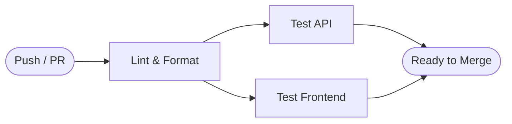
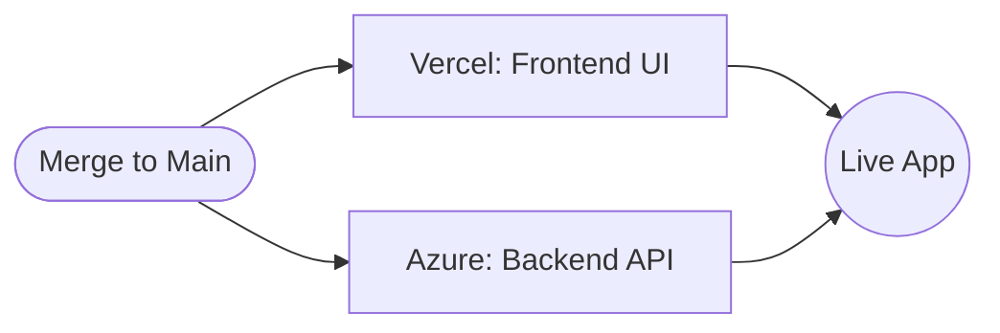

# Operations & CI/CD

This document outlines the GitHub Actions workflows and automation practices for the Cover Craft project.

## Automation Pipelines

We use path-based triggering to ensure pipelines only run when relevant files are modified.

| Workflow | File | Trigger | Purpose |
| :--- | :--- | :--- | :--- |
| **CI - Lint & Test** | `ci.yml` | Push/PR to `api/`, `frontend/`, `shared/` | Runs global linting and executes per-workspace test suites (`npm test --workspace=frontend`, `test:api`, etc.). Blocks merge on failure. |
| **Frontend Deployment** | *Vercel Managed* | Push to `main` | Automatic deployment via Vercel's GitHub integration. |
| **API Deployment** | `azure_function.yml` | Push to `main` (only `api/**`) | Builds, tests, prunes dev dependencies, and deploys the API to Azure Functions. |
| **Markdown Linter** | `markdownlint.yml` | Push/PR to `**/*.md` | Validates Markdown formatting using a custom action. |

## Deployment Configuration

### API (Azure Functions)

Configured via GitHub Actions and Azure Portal.

| Variable | Value | Description |
| :--- | :--- | :--- |
| `AZURE_FUNCTIONAPP_NAME` | `cover-craft` | Name of the Function App resource. |
| `NODE_VERSION` | `24.x` | Node.js runtime version for build and production. |

### Frontend (Vercel)

Managed via the Vercel Dashboard with automatic CD.

| Setting | Value | Description |
| :--- | :--- | :--- |
| **Framework Preset** | `Next.js` | Optimized build configuration for App Router. |
| **Build Command** | `npm run build` | Compiles the Next.js application. |
| **Output Directory** | `.next` | Default Next.js build output. |

## Secrets Management

| Secret Name | Required By | Description |
| :--- | :--- | :--- |
| `AZURE_CREDENTIALS` | `azure_function.yml` | Service principal credentials for `azure/login`. |
| `MONGODB_URI` | `api` (Environment) | Connection string for MongoDB (configured in Azure & Vercel). |

## Pipeline Architecture

### 1. Continuous Integration (PR Validation)

### 2. Continuous Deployment

The project uses a multi-cloud strategy for optimal performance and cost.

