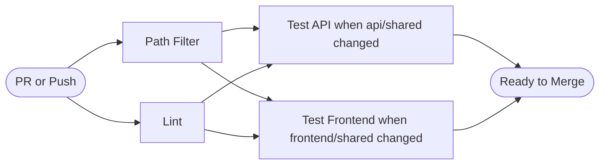
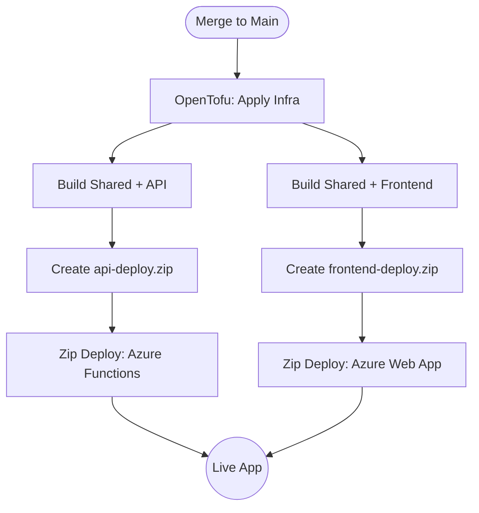

# Operations & CI/CD

This document outlines the GitHub Actions workflows and automation practices for the Cover Craft project.

## Automation Pipelines

We use path-based triggering to ensure pipelines only run when relevant files are modified.

| Workflow | File | Trigger | Purpose |
| :--- | :--- | :--- | :--- |
| **Infrastructure & Code Deployment** | `infra-deploy.yml` | Push to `main` when `tofu/`, app workspaces, or root package files change; manual dispatch | Applies OpenTofu, then zip-deploys the Azure Functions API and Next.js frontend to Azure. |
| **CI - Lint & Test** | `ci.yml` | PR or push to `main` when `api/`, `frontend/`, or `shared/` changes; manual dispatch | Runs project linting, then selectively runs API and frontend tests based on changed paths. |
| **Markdown Linter** | `markdownlint.yml` | PR to `main` when Markdown changes; manual dispatch | Validates Markdown formatting using a custom action. |

## Deployment Configuration

### Platform Infrastructure (Azure)

Managed via OpenTofu (IaC) and orchestrated in Canada Central.

| Setting | Value | Description |
| :--- | :--- | :--- |
| **Infrastructure Engine** | `OpenTofu` | Codified resource management via `.tf` files. |
| **API Plan** | `Flex Consumption (FC1)` | High-performance serverless Node.js 22 runtime. |
| **Frontend Plan** | `App Service (F1)` | Zero-cost Linux hosting for the Next.js standalone UI. |
| **Primary Region** | `Canada Central` | Targeted regional deployment for performance and compliance. |
| **API App** | `cover-craft` | Azure Functions app deployed from `api-deploy.zip`. |
| **Frontend App** | `cover-craft-ui` | Azure Web App deployed from `frontend-deploy.zip`. |
| **Build Node Version** | `24` | Node version used by GitHub Actions during CI and deployment builds. |

### Secrets Management

| Secret Name | Required By | Description |
| :--- | :--- | :--- |
| `AZURE_CREDENTIALS` | `infra-deploy.yml` | Service principal credentials for `azure/login` and Tofu `ARM_*` auth. |
| `MONGODB_URI` | `infra-deploy.yml` | Connection string for MongoDB (passed to Tofu as a variable). |

### Deployment Jobs

| Job | Depends On | Responsibility |
| :--- | :--- | :--- |
| `infra-apply` | None | Logs into Azure, initializes OpenTofu, and applies `tofu/` configuration. |
| `deploy-api` | `infra-apply` | Builds `shared` and `api`, installs API production dependencies locally, copies `shared/dist`, creates `api-deploy.zip`, and deploys to Azure Functions. |
| `deploy-frontend` | `infra-apply` | Builds `shared` and the Next.js standalone frontend, packages static assets, creates `frontend-deploy.zip`, deploys to Azure Web App, and sets the startup command. |

## Pipeline Architecture

### 1. Continuous Integration (PR Validation)

```mermaid
graph LR
    Start([PR or Push]) --> Changes[Path Filter]
    Start --> Lint[Lint]
    Changes --> TestAPI[Test API when api/shared changed]
    Changes --> TestFE[Test Frontend when frontend/shared changed]
    Lint --> TestAPI
    Lint --> TestFE
    TestAPI --> End([Ready to Merge])
    TestFE --> End
```

### 2. Continuous Deployment

The entire platform is orchestrated as a single, cohesive unit on Azure.

```mermaid
graph TD
    Main([Merge to Main]) --> Tofu[OpenTofu: Apply Infra]
    Tofu --> BuildAPI[Build Shared + API]
    Tofu --> BuildUI[Build Shared + Frontend]
    BuildAPI --> PackageAPI[Create api-deploy.zip]
    BuildUI --> PackageUI[Create frontend-deploy.zip]
    PackageAPI --> DeployAPI[Zip Deploy: Azure Functions]
    PackageUI --> DeployUI[Zip Deploy: Azure Web App]
    DeployAPI --> Live((Live App))
    DeployUI --> Live
```
