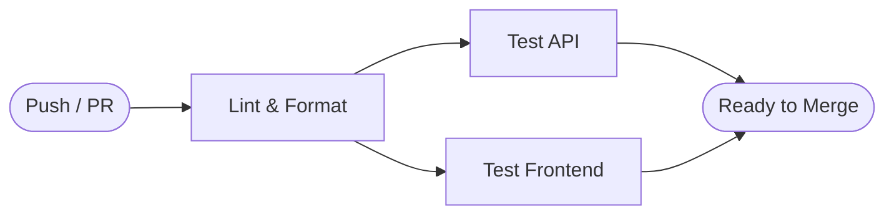
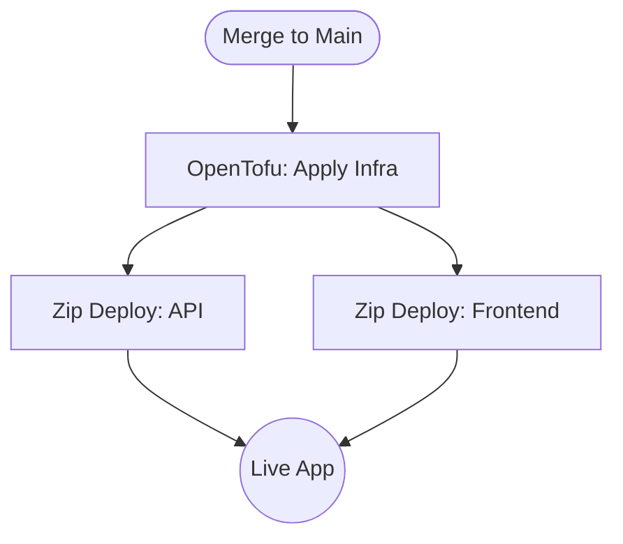

# Operations & CI/CD

This document outlines the GitHub Actions workflows and automation practices for the Cover Craft project.

## Automation Pipelines

We use path-based triggering to ensure pipelines only run when relevant files are modified.

| Workflow | File | Trigger | Purpose |
| :--- | :--- | :--- | :--- |
| **Infrastructure & Code Deployment** | `infra-deploy.yml` | Push to `main` | Orchestrates the entire deployment lifecycle: applies OpenTofu changes, builds and zip-deploys both the Next.js frontend and the Node.js 22 API to Azure. |
| **CI - Lint & Test** | `ci.yml` | PR to `main` | Runs global linting and executes per-workspace test suites (`npm test --workspace=frontend`, `test:api`, etc.). Blocks merge on failure. |
| **Markdown Linter** | `markdownlint.yml` | Push/PR to `**/*.md` | Validates Markdown formatting using a custom action. |

## Deployment Configuration

### Platform Infrastructure (Azure)

Managed via OpenTofu (IaC) and orchestrated in Canada Central.

| Setting | Value | Description |
| :--- | :--- | :--- |
| **Infrastructure Engine** | `OpenTofu` | Codified resource management via `.tf` files. |
| **API Plan** | `Flex Consumption (FC1)` | High-performance serverless Node.js 22 runtime. |
| **Frontend Plan** | `App Service (F1)` | Zero-cost Linux hosting for the Next.js standalone UI. |
| **Primary Region** | `Canada Central` | Targeted regional deployment for performance and compliance. |

### Secrets Management

| Secret Name | Required By | Description |
| :--- | :--- | :--- |
| `AZURE_CREDENTIALS` | `infra-deploy.yml` | Service principal credentials for `azure/login` and Tofu `ARM_*` auth. |
| `MONGODB_URI` | `infra-deploy.yml` | Connection string for MongoDB (passed to Tofu as a variable). |

## Pipeline Architecture

### 1. Continuous Integration (PR Validation)

```mermaid
graph LR
    Start([Push / PR]) --> Lint[Lint & Format]
    Lint --> TestAPI[Test API]
    Lint --> TestFE[Test Frontend]
    TestAPI --> End([Ready to Merge])
    TestFE --> End
```

### 2. Continuous Deployment

The entire platform is orchestrated as a single, cohesive unit on Azure.

```mermaid
graph TD
    Main([Merge to Main]) --> Tofu[OpenTofu: Apply Infra]
    Tofu --> DeployAPI[Zip Deploy: API]
    Tofu --> DeployUI[Zip Deploy: Frontend]
    DeployAPI --> Live((Live App))
    DeployUI --> Live
```
